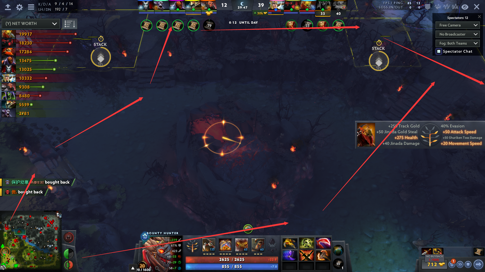
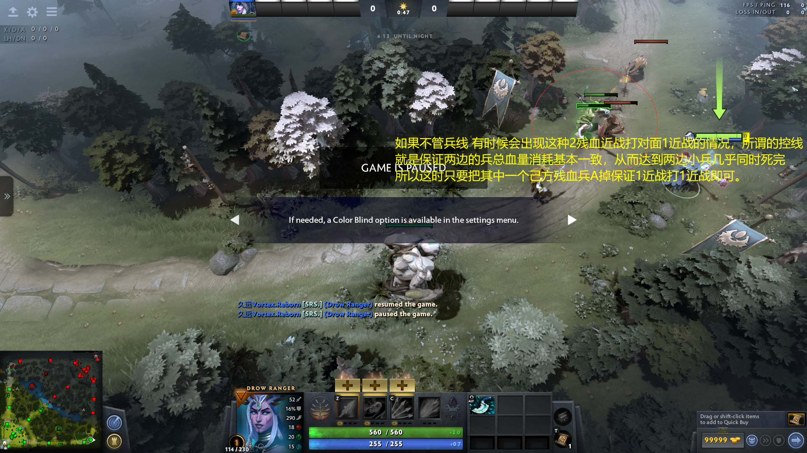
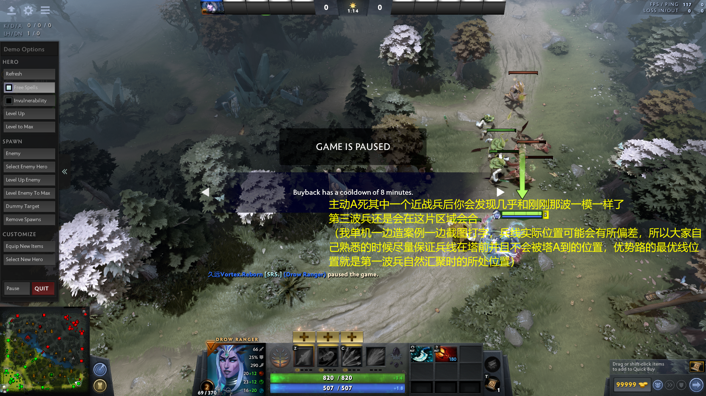
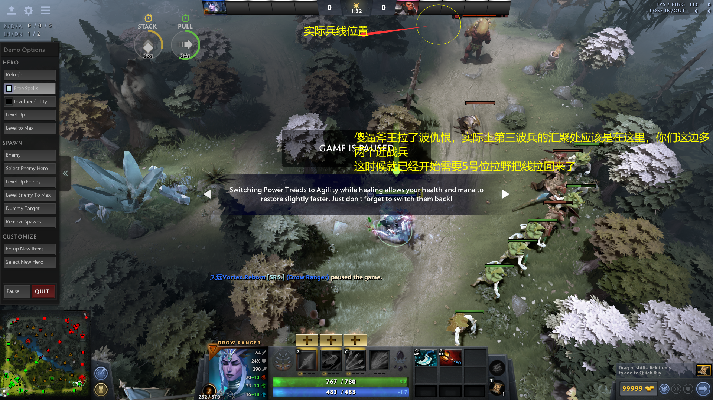
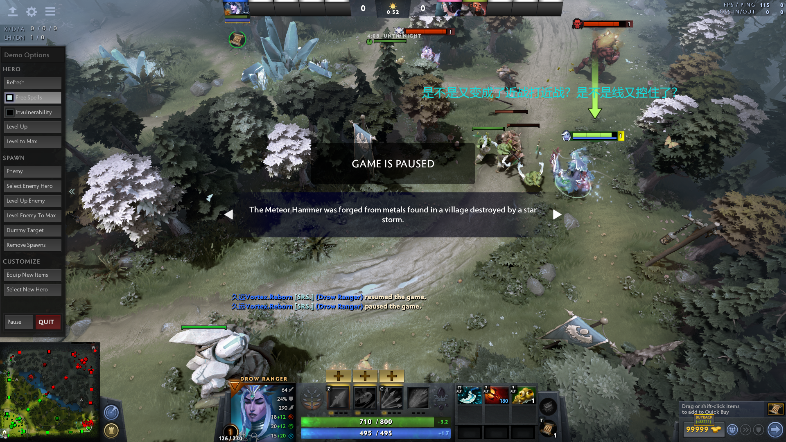
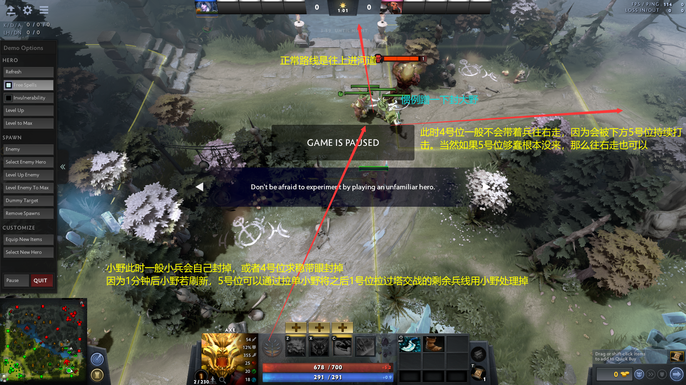

# 手把手教你5号位打线--久远Vortex扫盲式5号位对线攻略

前排提醒：

1.本攻略极其硬核，有大量文字和图片说明，极长！请谨慎选择观看地点，若不慎出现双腿蹲麻站不起来等症状我一概不负任何责任

2.本攻略只讲5号位打线，不要觉得内容少，看下去就知道内容有多少了，对完线后的处理以后看情况出，也有可能不会出，纯看我心情，毕竟我整的攻略一直都很费精力

3.扫盲教学指的是我直接在贴内给出5号位打线所接触到的几乎一切概念的定义，直接干碎某些玩家对辅助的错误认知，帮助观看者扫除绝大部分概念性疑问，旨在把此攻略变成词典一类的存在。之后遇到忘的或者疑惑疏漏的地方可以直接回来这里查找对应要点

4.介于上次攻略一次性发完结果几天就冷场过于悲惨，这次我采用连载形式慢点发，看得人可以存一点再看

5.本攻略只讲对线，所以适用时效非常久，除非V社做出拉野不勾兵仇恨或者野点直接给你删掉这种整个打乱对线运营的大型更新，不然贴内定义可以一直使用

6.因为攻略体量比较大且文字较多，可能导致一部分人看不进去。我在此保证，如果你将贴内给出的定义全部记住，实战能打出来，你的5号位对线保底六千水平。

7.本攻略主要受众：想提升的辅助选手、开黑想把朋友保舒服的选手、高分打核不玩辅助选手、意识流选手（我不知道为什么这么打但是我就知道要这么打），很多意识流选手水平已经很高不需要我来画蛇添足，不过看一看我把所谓的“看着打”给具体化一下也挺好的对吧

好的开场就一大堆废话，行了我们开始好了

## 一、前言

这里我直接放话了：绝大部分人，对5一无所知 显然，打dota的人普遍都比较喜欢核位，因为能吃到经济，有较大的作用，有钱就能秀能杀穿。但是核位尤其是边路13的钱是怎么来的?他们需要补刀，需要打野，需要经验，有时候人头也可以作为启动资金。相反，如果13没刀没野没头没经验，那他在这局的作用就会直线下降。那么，如何让自家的核位拿到这些启动资源，并不让对面的核位有启动资源，就是一个辅助所最基本的要务。 所以路人对线的前5分钟是获取启动资源最为重要的时刻。如果你家1号位5分钟2500，对面3号位5分钟1400还狗带了好几次，那你们就会知道这局会非常舒服。很简单，你家大哥有钱有等级就是强。 而大部分的1号位选手，对5号位的认知其实极为浅薄。结合多年逛MAX经验，我看到大家对5的普遍印象就是:点出来保大哥的，点出来混的，点出来当炮灰的，你怎么在OB啊？你会不会保人啊？给我买眼！给我贴药！给我拉野！别抢我补刀！ 说实话，在低分局辅助作用不明显的原因是两边的水平差距不大，经典小学生打架你一下我一下，这样基本功熟练的核位选手基本可以在这个环境无解肥，所以也衍生出了5号位等躺的概念。 这种观念实际上是非常脆弱的。一旦对面的辅助稍微有点水平，而且会开麦指挥他那条路的核位，我可以保证你这个看起来还行的对线可以被打得哭爹喊娘。 一个理解水平压制对面的5号位，在打7000以下路人的时候，可以保证劣势线大哥不崩，均势线打优甚至打崩，优势线按着对面打。 那么如何做到呢？5号位不太吃拼刀基本功，但是及其吃运营能力。你的面板，装备，你这条线上的技能，对面英雄组合的优缺点应对方案，都是你手中的一张牌。5号位需要对自己手里的每一张牌都有清晰的认识。你要做的就是把你的每一张牌打出去，并且都能压住对面，那你自然可以压制住对面的运营，从而解放你们这条线。 所以我在此对5号位对线所需要的每张牌下一遍定义，我可以保证看的进去的人必有大提升。

二、博弈从出兵前开始 2.1.选人的要素 选人其实在路人没有太大的考虑必要，只会有一个大概的概念，因为国服流行RD池，想玩啥你还选不到，比如最近RD池不给我面子又不给我VIS实在是nt。而且因为RD池的缘故，和外服不同国内一般都是先手抢1号位，然后辅助后手点去跟1号位配。所以如果你的英雄池越广，路人就越占优势。这里就结合一下路人的热门C来说明两个定义：保线辅助和压制辅助。 一般的辅助都拥有保线和压制的能力。 保线的定义：保线指的很简单，就是是让大哥补刀补的舒服。舒服包括但不限于你可以帮大哥抗揍让大哥少退回去吃补给，你可以消耗对面补给让对面频繁回去贴药从而给大哥创造空补时间，你可以在对面34合体强势的时候抓住对面的4捉对厮杀让大哥有和3号位solo的空间。所以对应的，酱油的保线能力和他的1打1能力，身板，和技能以及平A带来的消耗能力有关。 压制的定义：压制指的是能够配合1号位把对面34打的很难受。让对面难受包括但不限于你让对面上线就半血，你们能牢牢地把线控在优势路塔前不前推，对面吃树回不上安全学量需要频繁买药才能上线（这版本劣势路吃大药比较亏）你和1有很多机会打出叫杀局面并且自己没有太多的损耗（极限拼死一般不算压制运营）这样大哥不仅仅可以很舒服地补刀，还能很舒服地反补压制对面。（注意，有些压制线是需要大哥牺牲一些补刀来达到的，会导致大哥亏一点经济但是对面无解崩，六千以下路人基本看不到，想看的去首页局蹲一蹲有概率能看到） 所以根据辅助英雄选择的不同，以及和自家1号位的搭配不同，这条线的保线和压制能力自然也有所不同。我不可能把所有对线都列出来说明，所以举点例子，大家可以发散一下然后对号入座。 比如lich，lich是一个保线和压制都很到位的英雄，他在对面强线的时候可以通过芒果换大药来把一个人打走保证大哥空补，而如果对面是弱线，或者配剑圣这种1，又很容易通过减速配转这种减速高爆发来叫杀。所以为啥lich是热门辅助就这个道理 比如全能。全能是比较不常见的辅助，但是他在对面强线你们拼线拼不过的时候有着很好的效果：摆烂。我就站那给你揍，有2你打不死我，有1给大哥加血，有药给大哥贴，就是一个赖着你随便打。所以全能的压制能力比较弱但是保线能力比较强。 再比如小花仙。小花仙的面板懂的都懂，1打1a不过绝大部分4，对面34强你根本没办法，基本只能躲后面see。但是如果34是弱线，他可以配合自家1的技能轻松地突袭打掉对面一大管血。所以在1强34弱的时候 小花仙是一个很强的压制辅助，但是他的保线能力很弱。 比如AA，他是一个典型的保线英雄：手长可以白嫖对面，3技能好了就扔也可以打掉血量。而如果配了SV CK等带控1，那他就可以通过1配晕连招来轻松地打一大管血甚至叫杀来达到压制目的。AA的就是一个比较典型的根据配的1不同打法也不同的辅助 比如尸王。尸王是个比较畸形的压制英雄。他的压制能力完完全全体现在克制对面34可以无脑骑脸，和1级狂吃力量让对面不敢上线并且抢2轻松秒杀的时间段，越往后尸王打线的能力越弱。如果对面是双远，那么尸王的压制力直线下降到弱鸡水平。尸王就是一个比较典型的根据双方线上英雄不同。强度有明显变化的辅助 所以偏向于保线的辅助：对上强线的LOA，无控AA，WLK，冰龙，配弱1的lich萨尔双头龙蓝胖等 偏压制的辅助：lion，小花仙，小Y，蓝胖，bane，尸王，配强1的lich萨尔墨客神谕等。 共性已经给出来了，剩下没列的辅助大家可以自行判断 这里单列一下某些人人喊打的5比如TF。TF是一类英雄的代表：非对线5。他们的作用不是在线上，而是在自家强线对面34弱线的时候点出来吃资源的辅助。代表英雄是5号位的兔子，猛犸，潮汐，白牛等基本没对线能力的5。而这些英雄都是在线上吃了经验拿了资源以后在接下来的时间段有一个非常巨大的作用，而TF明显作用比不过潮汐猛犸兔子大和白牛的压图能力，对线又极其弱鸡，所以经常被拿出来痛批。非对线5实际上是吸了1号位的血，目的是为了对线后的战略运营，所以很明显要对之后的局势和团队打法有清晰的判断，所以属于比较吃水平的5，低分尽量别碰这种英雄也是比较合理的。

2.2.对线装备定义 吃树：常驻回血道具，不能够短时间内抬高血量意味着只靠吃树回会容易处于对面的斩杀线范围内。这版本吃树可以无限给大哥，所以5号位对吃树的需求大大提高，多买肯定是没坏处的 大药：短时间内恢复战斗力的道具，一套下去你家C红血没大药你这条线基本就崩了，所以你要做的就是绝对避免红血没大药的情况。另外退回去贴大药再回线上有个十秒左右的真空期，所以把别人打回去贴大药的时候控线也是操作运营之一。 芒果：核心在于保证自己关键时刻绝对有技能可放。回血给砍成添头了不谈了，所以芒果适量，多买比较亏，厉害的5一般会估自己的线上蓝耗，带适合的芒果。一般3个都算多了，两个最好，不行后面可以运1。 小蓝：自己接下来一段时间不会和对面交战，比如你在拉野的时候贴上回蓝。切忌切忌不要对线的时候贴，贴了要么秒断要么你贪回蓝躲后面就成为了传说中的挂机辅助。除非你想骗对面为了断你小蓝走位失误，不过我觉得一般人不会这么做吧。再说小蓝这版本还砍了，对线顶多买1个 仙火：战术道具。首先70块+2攻击就不亏，这东西的使用方法一般都是骗斩杀，高分宰低分对线作用无限大，打到高分不会有人不看对面物品栏吧，不会吧不会吧。树枝：剩下的钱多余格子塞满撑属性用，这个东西偏向于个人习惯，有人喜欢塞满还能吃，我是喜欢顶多带2合大魔棒。 魔棒：对面释放技能频繁时有较大作用。切记对面如果只是常规线，魔棒的200块钱对5号位来说会非常贵，特别是用J拉，J一来一回快两分钟了你要是只拉个魔棒，断药了有你好受的。 守护指环：0甲1甲辅助专用。这里给出定义：指环0-2甲是9%物抗，2-4甲是20%物抗也就增加了11%。所以你的英雄在初始0-2甲的时候守护指环的收益会非常高。保证你的血质会让你消耗更少的补给。 毛毛帽：一般都是出门买，同理高甲低血时毛毛帽收益也比较高，而毛毛帽因为250块钱比较贵，一般是辅助力求1打1占上风时出门就买而不是用J运，退回去贴大药也可以嫖更多血。 回复戒指：俗称回2实际上只有1.25，对面消耗能力强你当抗伤害的烂b时使用，一般对位天怒时购买，我记得dy某次直播还说过这个。你回的越多能抗的就越久，大哥挨揍的次数也就越少。对线就是一步步积累起来的，从这么一点回血开始。 毒球：只有近战强线或者近战1打1粘人时购买，其他一概不推荐。保线必不可购买。 草鞋：鞋5号位除了尸王打对面极弱线宰猪时购买，其他玩5一概不推荐。不谈别的，500快意味着你线上和大哥加一起只有6个树，你驾驭不住。别想着玩花的。低分5出门鞋对线必炸 补刀斧：5号位买补刀斧只有一个目的:开树。此时对面的4号位必是藏树林猥琐b，这类代表英雄大树，TF，炸弹人。开了树打和不开树打这些英雄完全是两个强度，130买补刀斧完全血赚。 真眼：打5出门必带1！保证你进可封对面野退可第一时间反掉自己的小野眼，重要性不言而喻。 护腕/系带/挂件：谁出谁nt，标准骗钱装备。辅助还不配用这个撑属性，你线上打的很肥也不会出这种玩意，现在天怒都不流行堆挂件了。 圣殿：混子保线5可出，比如WLK，自己血量一般都很健康但是蓝量经常见底，比较贪得人一般都会出一个回蓝。 其他诸如450之类的都是骗钱玩意，魂泪3分钟后看情况购买不算在内。五号位一般是没钱出骨灰甚至升大骨灰的，头环基本也可以看做骗钱玩意，除非队内钦定了你来做。 以上是对线常用装备的基本定义，你对线时身上的这些装备和j里正在运的装备就是手里的一部分牌，你要清楚自己手上的牌打出时的效果才能进行运营，一知半解瞎买一通属实弟中之弟。

2.3.基于对位判断的出门装备选择 刚刚我们把装备的定义都给完了，那么接下来就是如何用出门的600块钱达到这条线上的资源最大化利用。 什么叫对位判断装备选择？ 对面有刚背你出魔棒。 这就是对位判断装备选择。 你需要根据你这条线的4个人的特性，来判断你出门需要带哪些装备。为什么很多5号位容易被喷这就是一大雷区。 典型代表马尔斯拉比克/马尔斯凤凰，这条线是消耗和叫杀能力极强的线，你5号位出门起码6树1大药，吃完F必再拉一组补给。如果你出门带一些奇奇怪怪的东西但是就是不带够药，你家大哥俩技能一吃血一见底你这条线直接炸了，大哥只能躲后面等吃树慢慢回着看对面控线，你又一点忙帮不上，上去就是1打2，自己也没大药，你就只能see，然后等着被大哥喷吧。 这就是比较常规的对位出门装：对面消耗能力强我补给就拉满。 同样的思路，比如对面是弱线，他们是个4号位牛配3号位猛犸这种弟中弟线，消耗能力不行又没啥战斗力，那你要做的就是出门保证这个猛犸没好果子吃，所以你可以贪，比如狂撑属性或者多带芒果，力求狂干这个猛犸，保证更为效率地把他的血线打下去，这条线就会更优。 而在均势线的时候，两边手里的大药就是运营基石。所以你可以考虑这条线的运营要怎么打，如果主拼，药不能断。而如果想打的稳健一点，可以适当放宽出门带药的数量。这个也是具体情况具体分析。在之后我进入对线环节后我会讲的更为清楚。

2.4.分路变化运营 很简单的例子： 萨尔打5强不强？好强，太强了，然后对面后手点个LOA或者军团。哦豁完蛋。 那你要是萨尔你想咋样？是不是想换线？ 我要是萨尔我肯定不想跟loa军团对线，于是我就直接跑去劣势路，虽然可能萨尔打4作用小一点，但是起码不至于在优势路线挂机毫无卵用。 再比如我出了VIS，对面3是个弱鸡，我家这边完全能1打2，我就会直接沟通45一起去上刚对面优势路。我家的1放单，虽然劣一点但是刀完全可以补，也不容易死，而且对面的4大概率也会被我逼过去刚三，所以最后变成了1号位跟3号位1打1，但是对面刚三完全刚不过我们。于是对面的1号位被按在地上打，野区也进不去。我家1顶多线上小劣。所以请问整体上我们的运营是亏了还是赚了？还是血赚？ 这就是变化运营，根据具体分路情况的预演达成最有效果的运营局面。

2.5.其他 所以看我打了几千字知道出门前多重要了吧？ 所以能不能不要在选人时和出兵前吹逼刷手机上厕所倒水了呢？多花一点时间思考预演一下对线大概情况就能达到很好的效果，为什么很多人就是要浪费掉呢？ 因为他们根本没这个概念。他们只是机械地打这么一场，有啥事打起来再去想乃至根本不想，所以他们只能止步于当前水平。 这也是我这个帖子的目的:直接把概念和定义给出来，然后直接进行一个填鸭式扫盲 知道了，下次尝试了，你就确确实实地提升了。 提升不是一蹴而就，就是从这些地方积累开始的。

2.5.进游戏后第一时间行动路径 进游戏后很多人直接鼠标往中路一戳 然后直接开始刷手机刷他个半分钟一分钟 想想都知道过于nt 5号位在这段时间仍然有可干的事： 一个是之前我说的判断对面分路来预演对线 一个是撞去插眼的4号位 正常情况下，出门2个假眼，一个眼是中路线眼，另一个眼被4号位拿去插劣势路打线 出门时路人4号位大概率不会指挥全队打出门运营，而是直接一个人从劣势路走到对面优一塔及主野区插下手里的假眼 所以如果他在未插下眼，或者刚插下眼时就被5号位看到，要么5封住了4的期望视野，要么直接把4的眼给排掉 另一方面，如果对面是强线你确定你控制不住大野点，或者对面有强力控制大野点的英雄比如小鹿和POM，你出门是必封大野的。 综上，打路人开局5应该直接往优势路走，去撞正在单溜的4号位。走到对应位置转一圈，再折回中路准备抢F。 以下是开局4号位移动路径和可能插下的眼位，顺道我也放了封野眼和反封野眼，野点的定义和作用我之后某一段会详细说

这是近卫的出兵前眼位大致位置

这是天灾的大致位置

我列出的假眼位都是路人4号位比较常见的点眼位置 基本上沿着红箭头反方向都能撞到来插眼的4号位。 建议5号位选手养成撞4这个习惯，一两次没碰到无所谓，打多了收益必然爆炸 对面劣一塔前的假眼是5号位插了打线用的。一般不是出兵前插而是两分钟用商店更出的第一个假眼插，我作图顺道放一起提了。 这个眼位一般是看劣势路34的j或者看塔前是否有人t了想阴人。对面中单有时候会直接t劣一塔前游走，对面的5号位也有可能t过来进行一个偷袭。

中路这版本真没什么花里胡哨的眼位，因为需要提供抢f视野，就是中路线上下左右4个地方一插，然后蒙对面是插上路还是插下路。这版本中路全是人根本不可能给你探眼。一般遵循看到河道f同时能看到对面中路高台即可，然后两边赌脸看能不能排到

2.7.符点运营 2.7.1.抢F 首先我们必须明白最重要的一点： F有4个，而且分散在地图的4个位置，而抢F是8-10个人挤在一个F点打1级团，这说明了什么？ 说明其他3个F点没有任何人，随便去个人就能吃到 所以如果你的目的是拿F，那么完全没有任何必要去跟对面拼1级团。对面5个人站一起顶多顶多控制2个F点，所以你无论如何保本都能拿到2个F。 所以抢f打起来的本质是:为了1级团出fb 所以考虑抢F只有一个最基本最基本的原则：你们比对面强 在决定抢F前先掂量掂量自家阵容1级团水平，别无脑跑过去送了: 自家有TB水人不抢 对面控多不抢，杀不到人拿不到F还被揍一顿甚至有可能去世到底有啥意义 对面有VIS海民土猫墨客等1级团战斗力爆炸的英雄，绝对不抢。你要带队过去送那你可真是小天才。 我前段时间打首页局拿VIS打1级团打了个2换5。你没看错，1级团2换5，对面5个人，包括两个红地球，全部，回家，泡温泉。我群里还有录像来着，截两张图在下面你们自己体会。想给自己找不自在那你可以尽管来送fb，很欢迎的

既然比对面弱别想抢F，那我们来说比对面强的情况 比对面强，就是把我上一层的情况调转过来，你们有这些特性英雄，有爆发有控制，而对面很明显比你们弱 那如何才能保证1级见血呢？如果按大部分人那样直接站河道高台挂机，对面看到有人直接走了，你们强势1级团阵容杀不到人，没有达到预期也算是一种亏 这时候出门的第一个雾就有作用了：出门的第一个5可以让己方大部队从一个比较偏僻的位置绕到对面后方 下面放两张图，其实也很常规，主要还是给低分不常用5的人看的，50块毕竟买不了吃亏 注意图中的箭头是双向的，你们可以全队这样过去，对面自然也可以全队这样过来。 所以你们可以看到职业比赛经常有两队全队开5互相绕地图一周，一方面是点眼，一方面是开5打1级团先手。 一般路人局的强度还没有达到边路眼需要开5做的程度，所以第一个5一般都是拿来开团，当然不想开团这个5也可以给4留着打之后的运营

2.7.2.偷F 对面1级团强势的一个好处就是，他们如果确定我们不敢抢F，就可以从5人大部队中分出1-2个人来控制另外1-2个F点，而这些英雄有的是带控或者1打1强力英雄，导致和他们拼抢F己方也不占优势。 而因为对面此时基本上都挤在河道准备打河道的2个F点。 所以我们可以选择偷掉对面副野区的F。 因为对面很强，知道我们不会接团，下意识会觉得副野区的F可以保本，绝对安全 所以此时对面的注意力大概率全在河道， 因此我们有相当高的成功率偷掉这个F 放两张图直接解决问题

第二大节终于更完了，总计6000字左右 注意，此时此刻，甚至，还没有出兵。 还没有进入对线环节，甚至可以说我的帖子还没正式开始 再注意，我上面说的，全是最基础的定义。 所以说，为什么高分打低分是碾压？ 很多人觉得高分基本功好。 不仅仅是基本功压制。光是理解，高分就已经将大量的内容化为了基础，并且加以自己独有的运作理念。 说白了，所谓的理解碾压，就是想的比你多太多了。 啥都不想不学，公式化单线程看着打的选手对上他们，不被碾压实在说不过去吧。 今天应该能进第三大节到对线环节了，歇会歇会 我想和拉拉米亚量产生命.jpg

三、出兵后至1分钟野怪刷新前对线运营 3.1.抢完F后到上线前 为什么抢完F后还得列一小节来说 因为还是有一部分人习惯实在太差，抢完F直接鼠标往自家优一塔一戳。 抢完F走到线上可以省一张tp，所以很多人选择抢完F一路穿过自家主野区走到优势路一塔和1汇合。 问题就出在这里。 抢完F你们的人都散了准备去线上，但是对面可未必这样。会玩的45会直接在高坡处等着截这些不带脑子的傻白甜。 结果就是你在上坡时被对面一顿狠揍，甚至直接豹壁，哪怕抢F没FB，你这一送FB也给了 以下两张图是事故多发区

同样，1和5也可以通过同样的方式蹲那些不带脑子的4号位，大部分都是在这两个点。 一波好的阻截能直接打掉对面一半血甚至击杀，打掉对面一半血一般那种出鞋的4直接就萎了只能躲后面等大药到，这样你们第一波兵直接就是2打1。

3.2.第一波兵控线解析 3.2.1.正常汇聚兵线走向 这个直接用图来解析，直接看图即可

3.2.2.兵线变化案例1 因为种种原因，你发现第一波兵最后剩一个你们的远程兵，这会导致对面的第二波兵血量不满，显然这样会导致兵线前移，那我们应该怎么做呢？

3.2.3.兵线变化案例2 因为种种原因，你发现第二波兵汇聚时你这边的远程兵宛如战神并没有死甚至几乎满血，这样会导致第二波兵是2远程+3近战打对面1远程+3近战。这必然会导致兵线前推。 如何处理呢？

3.2.4.兵线变化案例3 对面一上线就开始把你们的远程兵往对面的近战兵处勾，这时候对面的近战兵并没有去打你们的远程兵而是仍然在打你们的近战兵。这时候又如何处理？

第四张图中对面的3会回去接推过去的线等于不会参战，而1号位带着兵溜圈的行为会被对面的4报复性打击，所以5需要在这个时候把对面的4给赶走让大哥少掉点状态。

3.2.5.兵线变化案例4 对面拥有POM 这种可以迅速秒掉你这边远程兵的英雄，这样第一波线就会变成对面3近1远打你这边3近，这又如何处理呢？

这些控线案例基本都是1号位的基本功 我之所以放在五号位的攻略里 目的就是让学习的5在自家1不会控线的时候帮助1号位控线: 开麦指挥1号位 1号位不会拉仇恨你可以帮助1号位拉仇恨 这样即使一号位是头猪，你也能尽可能去减轻他的无能带来的负面影响。 当然自己玩1号位的时候这些最基本的控线是一定要掌握的，这是除了补刀之外的最基本功

3.2.6.控线的意义 补刀运营，包括后面将会提到的拉野，意义都在于把兵线控在自家的塔前。 此时你这边的1号位可以安全站在塔的攻击范围内补刀，而一旦对面的4远离兵线，或者对面3号位贪某个刀走位靠前，1和5就可以迅速地两人合体打击敌方3号位迫使他损失大量血量甚至直接去世。兵线离你的塔极近而离对面的塔极远，所以敌方三号位在以一敌二时并不能快速地撤退到塔内安全区，会被追着打一整条长线。 而相反地，如果15随意推线，线就会跑到对面的一塔下。这样上面双方的优劣势直接互换，己方的一号位就会面临刚才我所言三号位的一切危险。 所以为什么强调控线，控线就是保持稳定进可攻退可守的稳健阵型。保持这个阵型自然就能轻松地打出线优压制对面。

3.3.第一波野刷新前对位的思考与运营 上面我着重写了第一波兵的兵线常规走向，这些走向只是最基础的无干扰或者少干扰走向。在实战对线中，每个英雄都有不同的特色，如何打线取决于你对两边英雄的理解和经验。

3.3.1.简单判断此线优劣 在抢完F已经清楚这条线对位的时候，5号位需要立刻判断出自己这条线的主要运营方向：这条线是优线还是均势线，还是劣线，还是大劣线 此处判断线优线劣大概有以下几个要点： 1.两方是否能稳定补到远程兵 远程兵是一波线的精华，拥有更高的攻击，更多的经验，和更多的击杀金钱。所以如果你想保证自己能稳定先于对面到2，是否补到前两个远程兵非常重要。而双方的远程兵都是离对面最远的小兵，就会导致补到对面的远程兵较为困难。所以用技能补红血远程兵保证收益是非常正常的操作。如果你用技能补了红血远程兵1号位觉得你抢了他的刀，那基本可以定性他水平不会太高。 2.两方的2打2和1打1能力。 这段我草稿举了挺多例子然后想了想全删了，强势弱势英雄组合可太多了。技能强不强面板强不强直接打开客户端一查就知道了。军团拉比克就是强，马尔斯凤凰就是厉害，没人想和开弹片的发条对A。你点个冰龙保PL去动军团拉比克的手用脚想都知道打不过。但是如果对面点个末日加牛这种双白板，那用脚想也知道你们2打2血妈优 3.对面34是否能强行推线 我前面举了第一波兵的控线细节，但是当对面拥有强力AOE技能的时候可能根本不跟你打运营而是直接用AOE灌兵推线。 比如大屁股加拉比克，上线大屁股直接给火雨拉比克X掉远程兵，一整波兵线全进你塔里了。第二波线就会在塔里会合，防御塔疯狂输出对面小兵，到了第三波线，自然就会前推到对面的塔前。这个强推线能力在打一些以1级靠平A消耗的辅助有非常明显的效果。比如AA，第一波兵正常对位打 对面3要被AA白嫖个十下左右平A夹着俩法球就很难受，但是如果对面推线，AA就直接等于挂机了。所以表面上你可能点了个AA加SV这种combo阵容觉得自己是优势线，但是会被对面轻松化解。

在判断完这条线的优劣后，就可以进行预演运营 先讲大劣和大优，最后讲均势线。 3.3.2.大劣线运营方向 时刻记住，你们是大劣线。 比如AA保PA打军团拉比克。不考虑实力压制，这15点出来基本上对线就判**了。所以5要做的就是尽可能地让自家1起码能混到补刀。 因为是大劣线，你们会被消耗得非常难受，还时刻有生命危险 因为是大劣线，你们不可能控制住大野点。 因为是大劣线，你们不可能控得住线。对面随便拉大野控线你们一点办法没有 所以相应的三点: 1.你手头的一切资源全部转化成大哥站住线的基本保障：补给 2.绝不让大野点刷出来一波大野 3.尽一切手段把对面的4拉走1打1，让1号位去和对面3solo 再加一点，无脑拉小野。尽一切可能让大哥吃塔刀。 你会打的很不舒服，你会非常穷，你甚至可能4分钟身上除了药什么都没有。 这是你为阴间选人付出的代价。 但是你依然打出了作用。 拼上全资源补给大概打到4分钟大哥极劣的线也会有1700以上的经济。 开黑你这么打 你的朋友会很舒服。 路人你大可不必这么无私，不爽直接下一把。 下把选人带点脑子。 但是如果你想赢，拼补给拉人1打1是换线以外的唯一解法

3.3.3.大优线运营方向 此时对面的34是弱鸡中的弱鸡，比如SK3滚滚4这种我都不知道怎么打线的配合（应对勾兵后面会单独讲） 你们15要做的就是不给对面上线。 越线直接点，前压到对面的远程兵平行位置处赶人，点跑了原地回头控线，对面敢回来继续赶跑。 这时候对我之前提到的控线就有要求了：越线点人拉到仇恨导致兵线变化后，仍然能保证兵线控在塔前。 然后对面肯定就炸了。 就这么简单，但是低分选手总能超乎我的想象。我ob朋友打或者ob教学的时候经常看到三四千分男神打个100开线还搁那你拍一我拍一，你A一下兵我A一下兵，时不时友好对A一下然后继续A兵属实搞笑，这玩的都是啥。 所以我得专门开一小节讲大优线咋打这种废话。希望一些男神不要再做这种看着搞笑的行为了。

3.3.4.优线运营方向 通常己方有一个比较强力的甩技能5号位比如lich，1号位比较常规偏发育，比如是个PL或者是个幽鬼，所以还没到碾压线。 对面34是较弱一点的常见配合，比如夜魔配lion之流。 我觉得正常的5号位都知道对着对面放技能或者a人吧。这里的要点是，如果你的lich对着lion放了一个V，那么接下来的2-3个V和平a也得是对着lion放的。 本来你V2下lion追着A，可能lion要交一个大药或者躲后面慢慢回约等于减员，然后你再和1一起揍夜魔。但是你V一下lion再V一下夜魔，他俩一人吃一颗树就回上来了。你的压制力荡然无存。 而且你左边V一下右边V一下，我可以告诉你你出门带六七个芒果都不够用。 你手头的消耗技能只有集火同一个人才能造成有效消耗，切忌雨露均沾。 另外既然你们是优线，你们可以较为轻松地控制野点。所以出门的第一个真眼通常用来反掉小野封野眼。大野看着封，之后我会详细说野点的作用。 然后就是拉双小，拉大控线之类操作。尽可能把线控在塔前的同时消耗对面，并且在对面走位失误的情况下找机会击杀。 在对面对线劣势的情况下会有更多的失误走位给你抓，比如3号位为了个远程兵前压，比如4号位逛到了你能留住让大哥过来的位置。击杀1-2次，优势线就会转变为大优线。一个比较强的5就很会抓机会扩大对线的优势。

3.3.5.均势线运营方向--越线点人衍生出的对角对位法 严格来说并没有完全均势的线，任何组合对垒都会有自己的强势期和弱势期，比如有的组合1级较强但是2级较弱，有的组合兵线控住很强但是兵线拉胯较弱。所以我举一个比较常见的对线结合图来进行说明。 萨尔+幽鬼打马尔斯+天怒 萨尔是一个比较强势的英雄。他的1级电有很强的消耗能力，但是在大部队到2直到3级前会有一个非常明显的疲软期：他的其他两个技能只能控制走位而并不能造成实质伤害提升，顶多多几下平A 幽鬼是一个牛皮糖英雄，比较肉，有1技能可以稳定收远程兵，但是对线的压制力较弱。 天怒是一个前2级爆炸强的英雄，拥有着优秀的攻击距离，T有强力的减速+伤害。所以天怒第一波兵的T配合马尔斯duang+平A消耗能力非常之强，到2可以打一波很强的爆发。 马尔斯是一个非常常规的3，他和天怒是很经典的34合体强力组合。但是马尔斯1级只有一个duang，到了2级才有和天怒击杀敌方的能力。而马尔斯先2多个矛很明显比天怒先2更为强力 那我作为一个萨尔，我很容易就在吃完F判断出对面是一个1级强线，马尔斯先到2更强。那么我的运营方向就会是想方设法去让马尔斯难受。所以这个对线我只会电+A马尔斯，电天怒一次我都觉得亏。 如果对面不乱线，我如果想不停地消耗马尔斯，只电肯定不够，我想一边电一边A马尔斯。 这就涉及到越线点人了。在马尔斯上线的时候直接电马尔斯并且不停地A他。但是A马尔斯会乱线，你离线太近小兵会打你。很多水平不高的5 A着A着还会乱走位白给 所以具体该怎么做呢？直接放图

对角对位法适用于绝大部分想压制敌方3号位并不想和对面4号位交战的对线运营。一般情况下两方的45就在己方13身后来回反复横跳，此时消耗能力更强的辅助显然就更胜一筹。 而如果对方的4菜的抠脚，根本不知道有这种运营方式，只是漫无目的地进行布朗运动 那对面的3就得不停地吃药，因为你的消耗效率异常之高 一旦断药，对面线上立马爆炸 这就是一个非常明显的理解碾压例子。我知道我在做什么，我的每一个行为都有意义。 但是你根本不知道我在做什么，我自然能把你家3按地上打，而你只能挂机ob。 这就是高分辅助和低分辅助的理解差距。理解自己的行为意义远大于不理解只是随便打打

3.3.6.低端5第一波兵常见nt操作鉴赏 1.不管仇恨顶着三四个兵和对面两个人battle 比如楼上第二张图的萨尔吃了个T还在那往前走A马尔斯，同时也不知道取消仇恨，马尔斯回头一个duang直接跟天怒把萨尔按地上透，幽鬼除了给个标只能看着萨尔被透。结果萨尔被透了一大半血只能缩回去贴大药或者猥琐等吃树回，幽鬼被两个人狂揍无还手之力。 本来是你消耗对面3一小半血，结果是对面用一小半血直接打了你一个大药，属实逆天。 2.瞎b点人把兵带塔里了 萨尔A马尔斯A了两下然后直接回头往塔里走，然后不知道取消仇恨 然后两个小兵直接跟着萨尔跑塔里了。你家幽鬼补刀补着补着被迫吃两个塔刀，与此同时对面的两个近战兵光速去世，第二波线直接推到对面塔前，幽鬼直接大口吃翔 相信我幽鬼此时肯定对你的家人有那么一些想法 3.躲后面只放技能不A人 这个不用配图了，标准ob侠。消耗技能一定配合平A才能打出效果，只放一个技能，对面有25魔抗你只能打100不到的血，对面一个树就回上来了。 反正你把技能都甩了后面就不关你事了是吧 建议好好反思啥叫消耗对面 4.技能都不放躲后面偶尔A两下 没任何话说，建议重开 建议能打出以上神级操作的选手好好看好好记，别整天怪队友了，你就是万恶之源

再补一条:蓝胖之类近战5点人的时候带着三四个兵跑 典型的不知道怎么取消仇恨，虽然蓝胖甲高血厚抗揍，兵对蓝胖的消耗并没有那么大 但是对面的小兵在a你蓝胖，你家的小兵在追着对面的小兵a。 这会导致一点，就是我之前说的对面的小兵血量损耗远大于己方小兵 结果就是兵线会往前推。 所以表面上看似你一个蓝胖追着对面狂揍神勇无比，实际上两波兵一下来兵线就跑对面塔前了。 你再勇你能追到塔里a吗？所以蓝胖的强线优势此时荡然无存 玩近战5的时候一定要记住随时a自己小兵取消仇恨，并在仇恨cd内继续追着对面打

昨晚打的一局首页局编号忘发了，开一楼再发一遍。 保的美杜莎打ck墨客，对线总体来说比较满意 美杜莎操刀者是cdec的1号位once，是世界第一中单cdec.blood.肥皇 的强力队友 对面电狗是老鸡 rep有效期一般是一周，建议大家带着我目前说的内容去复盘看一下对线环节，看看能不能发掘一些自己之前不会注意到的新东西 编号6069692777

3.3.7.剑走偏锋--优势路推线抢2运营 在之前的3.3.3-3.3.6几个小节中，我都将推线视为一个及其nt的操作加以预防，将其作为反面教材，一再提醒大家推线是nt行为 那么优势路第一波兵推线真的一无是处吗？答案是否定的。 我之所以放在nt操作鉴赏小节之后也是为了特别区分开来，本质上这是个非常规运营 (这里打个预防针，低分环境选手请根据自己实力水平慎重选择以下打法，能力不足真的会导致推线一无是处）

优势路第一波直接推一般为了一个核心目的：抢2。 举个例子，己方大圣+萨尔，打对面刚背+天怒。 大圣1级学被动去和刚背对撸很显然会被刚背加天怒打的妈都不认识，4下回血根本吸不上来。 而此时即使兵线处于优一塔前，大圣补刀也并不舒服：仍然会被刚背和天怒消耗。 但是大圣和萨尔到2的瞬间，大圣这条线就拥有了两个强力留人技能，其中板加被动还有高额伤害。而此时若刚背仍为1级，没有被动，只有1级刺的刚背宛如一个nt 所以这条线很明显是1级弱2级强的线。此时我想要进行的运营就是尽可能让己方比对面更快速到2级。

这里给出兵线经验定义： 单人全吃第一波兵经验可以让一个人到2。 那么两拨兵全吃自然会让2个人到2。 若5号位让大哥单吃几个兵的经验，大哥只需一波半兵即可到2。 互有反补且辅助不让经验的情况下，若己方的反补比对面多，第三波兵双方不都推线的话必定己方先2。 若第三波兵到达时双方仍未到2，杀第三波兵杀的快的一方会先到2 所以如何快速到2呢？自然是推线。 所以高分对局中，大圣基本1级都会学板，在进行一个之前提过的将两边近战兵勾至远程兵处的勾兵操作后直接叫板连着所有小兵和刚背一起板，收掉掉对面的远程兵并打掉对面近战兵的血量，同时萨尔用电+平A赶走刚背不让其反补小兵使己方亏经验。 这样自然兵线会前推。但是你会发现，即使兵线前推，对线的环境并没有发生改变。 你在塔前被天怒刚背耗，你在中间线区一样是被天怒刚背耗，有什么区别呢?所以兵线前推并不会造成恶劣的后果。 而刚背本身就有被迫推线的特质，他若用刺补刀CD较长且伤害较低且会溅射到其他小兵，造成好几个小兵同时红血。大圣此时就可以较为轻松地反补掉己方小兵。这样就会变成己方经验几乎全吃，对方却亏了好几个反补。 所以你们必然比对面先2。 到2的一瞬间萨尔直接动手框电追A，大圣跟上敲出被动直接就是一板再将剩下的3层被动全部打出。而此时刚背只有1级并无被动减伤，旁边支援的天怒给出的减速T会被前压的萨尔吃掉打不到大圣的身上。所以大圣可以轻轻松松地宰杀刚背。这就是一个经典的抢2运营。 当然我的描述比较理想化，实战会有各种各样的阻碍。 而我想表达的就是：当确定己方两人先于对面到2时有叫杀能力或者强大压制能力时，推线就会作为一个可选项。 再次提醒，低分路人15配合捉急，慎用。没想清楚瞎b推线被喷别来找我。 开黑的选手可以尝试练一练抢2配合，打线效果会事半功倍

四、出兵1分钟野点刷新后运营 4.1.野点的定义 玩辅助不多的人，应该动不动就能听到大哥在那喊：你赶紧去拉野，会不会拉野啊你个XX 然后通常辅助就屁颠屁颠跑去拉野了。然后你这条线就炸了。 实际上的情况是，低分打1号位的，对兵线的理解也相当不到位。他让你去拉野，可不代表此时拉野就是最优解。 低分辅助自己也特别喜欢无脑拉野，把拉野当成个任务，拼命拉，拉完还沾沾自喜:看看我辅助的多到位。 结果就是把兵线搞的一团乱，然后兵线来来**折腾了一段时间，最后又tm跑对面塔下了。此时野点的野已经被你拉野拉空了，这时候低端5就直接两眼一瞪开始挂机。 这和ob挂机辅助又有啥区别呢 所以如果你不搞清楚野点的定义，只把拉野当成一个单线程操作，那你必不可能打出线优，甚至本来打得好好的线也给你搞的乱七八糟。 以下详细给出野点的定义。

4.1.1.大野点定义 大野点拥有5种野怪：熊怪，人马，萨特，枭兽，巨魔 巨魔有着周围死人会招两个小骷髅的特点，这两个小骷髅很多情况下会封掉这个大野点，如果你希望野怪继续刷新请不要忘记把小骷髅A掉 人马和熊怪周围判定达到3个人（包括英雄和小兵）时会释放踩地板。 其中人马的踩地板对消兵没有帮助，而熊怪的踩地板有高额范围伤害并且释放较为频繁所以把兵拉到一波熊怪大野处，熊怪放两个踩地板就可以快速消掉一整波兵线。 熊怪外的4种单大野不能消掉全部兵线，但是可以将一波兵牵制在兵线路径外并消耗掉其中2个兵。 任意两拨大野组合均可以轻松消掉一整波兵，熊怪+任意其他野怪组合则进化为光速消兵，10秒内一波兵一个不剩 如果你想解放这一波兵线，就去和小兵一起把大野点A干净，这样兵线就会回到线上双方的兵线会在同一时间产生，你将己方的小兵拉至大野处，对方的小兵前进途中就不会有人阻拦。 大野双方都可以拉，双方拉大野的本质都是是让兵线迅速回弹到己方塔内。 若不想让兵线进己方一塔，可以用身体把兵线带着在塔前范围遛，直到下一波自己的兵接上位置。 34拉大野会比15拉大野容易不少。上路线天灾15有开树位可以较为容易地利用大野点，而这版本下路野点和树林做了调整，近卫15拉大野变成了一件比较困难的事。所以下路线15基本无法利用大野点 下图给出双方拉大野时机

图中可以看到34方在大野利用方面明显要比15有优势得多。 当1分钟大野刷新后，若兵线处在优一塔前，4号位可以通过拉大野来阻断下一波自己的兵线从而使优势路兵线前推至劣一塔前。 此时3号位和4号位轮流抗兵直至其与下一波自己的兵线汇聚在劣一塔前位置，这时候兵线就完美地卡在了对面塔前。 这是15最不想看到的兵线位置。 而若15远弱于34，对面就可以肆无忌惮地随便使用大野控线而5基本无法干扰，谁让你们弱呢 所以平时大家都在说的封大野的本质是: 在己方完全无法利用大野点控线，而对方可以轻松利用时 阻止对方利用大野点。 毕竟大野不刷你只能拉个寂寞。 如果你觉得己方可以利用大野点，只是不想让对方在1-2分钟这段时间使用大野点，那么只需59秒站过去人肉封一波即可。2分钟大野仍然会正常刷新 如果你们是大劣线，兵线控制能力被对面完爆，那么，人肉封也好，真眼封也好，请不要让大野点刷出哪怕是一波大野。这也在我楼上写的大劣线处理中提到了

论外:敌方4号位是小鹿、大牛、pom，必封大野！ 小鹿可以直接ntr个大怪爹来揍你，ntr的要是熊怪大萨特不好意思你这条线看着就绝望。有大野的小鹿和没大野的小鹿是两个英雄 对大牛来说优势路野区的每一个野怪都会转化为自己的攻击，移速和护甲。若让大牛堆了双大野加你这边的小野，大牛直接化身战神 pom拥有秒杀大怪获取高额经验和经济的能力，而射杀大野又可以迅速使拉到的小兵返回线上，所以pom可以轻松地利用大野获取资源和控制兵线走向 （别再喷辅助pom了，高分pom打4真的特别强，技师不行别怪英雄)

另外当对面3号位是钢背潮汐之类清矿英雄时很多人惧怕优势路大野点过多堆积 其实是没关系的，因为这类英雄必定是在到达5级且兵线前推至优一塔内逼对方1补塔刀，或者击杀了对面英雄时才会考虑清矿。提前做好准备通知自家中单优势路矿很多，让自家中单把对面34打跑，那么对面花尽心思屯的矿就全变成了你家中单的肥料 当碰到这些屯矿英雄时，需要顾虑的则是对面三角区是否有矿。这方面后面我会提

4.1.2.小野点定义 小野点是路人重灾区，也是大哥最喜欢bb辅助去拉的野点 这里继续给出小野点定义 小野点拥有5种野怪组合：毒狗X3、狗头人一家5口、狗头+小巨魔X2、电鸟X3、小巨魔一家 其中狗头人一家一个兵都消不掉，乃弟中之弟 单拉其他野怪都可以消掉一个半兵，狗头人+双巨魔消掉一个兵多一点。其他的小兵会在打完小野后继续回线上推进 若屯了双野，则可以用一大半双小野消掉一整波兵，通常最后会剩3个左右小怪 若屯了狗头人一家+任意其他小野，那这波双小野应该是只剩两个以下。 （所以狗头人这种小野毒瘤谁沾谁倒霉，能不能赶紧爬啊）

那么，拉小野的目的到底是什么呢？ 可以看到楼上的定义中双小野可以消掉一整波兵。 主动拉野的一方是5，对面的4若没意识到则会至少亏两个兵的全部经验和经济，剩下的两个兵4也得同时和5以及好几个小野拼刀，不放技能只能吃到经验。 若5反补成功甚至只能吃到一半经验。而此时3号位基本损失了一整波兵线没有任何收益。 一般对方会选择拉大野来进行对应，同时3和4其一过去吃经验或者把1赶走。此时相当于这一波的双方兵线全部进了野点处。 但是若对方并没有拉大野或者无大野可拉，此时因为一波兵被全部消耗，对方对应你拉小野的这波刷出的小兵会进行添油战术把15这边在线上交战的剩余小兵全部干死，然后全部挺进优一塔。1可以轻轻松松地吃掉一整波兵的塔刀获取全额经济和经验。 （1塔刀全漏建议召唤拳头呈攻击表示，然后把1的头按显示器里） 所以拉双小野是非常有效的打击3资源量同时保证1资源获取量的方式。 另外，若兵线已经处于劣一塔前的稀烂位置而1又较为线弱，此时如果5因为种种原因无法拉大野将兵线回拉（可能是4号位霸着不给你拉大，也有可能是你自己封了），则5号位需要迅速跑到小野点将正在前进的小兵拉至小野处。 尽管单小野并不能消掉兵线，但是可以阻碍兵线的前进。这样对面的兵线同样会挺进。这时候兵线就不再处于劣一塔前。尽管你兵线没消干净之后仍然会前推，但是起码权宜之计也是有效果的。1起码这段时间能舒服一点。 下图给出拉小野时机

4.1.2plus.低端5无脑拉小野犯病操作鉴赏 1.兵线好好的稳定在优一塔前还要跑去拉野 送你4个问号 ？？？？ 没麻烦找麻烦是吧 2.对面一大波线准备进塔时跑去拉小野 结果是什么，结果是一大波兵进塔，此时没有己方兵线接住交战，这样对面34可以轻松惬意地跟着大波兵线进塔两个人痛扁你的1。 此时1得同时和对面两个大汉以及高额攻击的己方防御塔拼刀，而且对面可以肆无忌惮地往1脸上招呼技能甚至动手叫杀，1非死即残。 1高呼我的队友在哪里？ 5自信回答：我在拉野！ 不喷你喷谁呢？ 3.拉小野前不跟队友沟通清楚 这是低端局最容易出问题的地方。本来1的水平就不是很高，线跑对面塔前，1还在补刀，补着补着5跑去拉小野了。然后1以一敌二壮烈牺牲 1高呼我的队友在哪里？ 5仍然自信回答:在拉野！ 确实，兵线在对面塔前需要拉小野将兵线控回来让兵线处于比较舒服的位置 但是请好好看看从劣一塔门口到小野点，再到拉出小野的一二塔之间的距离 好家伙十万八千里，还得折返跑 你要是大摇大摆直接跑回小野点处拉野，拉完再大摇大摆跑回来，需要多少时间？ 对面34会玩点看你人没了直接动手，请问你能帮到1吗？ 所以在这种情况下一定一定，要么打字要么开麦，去告诉你的1，我去拉野了你怂一下 各个分段的1水平不同，想法也不同。有的1可能只想贪塔前那几个刀，有的1觉得即使线在对面塔前也可以打，有的1有更多自己的想法 不管1的想法正不正确，你不进行沟通突然撤回去拉野放1落单的举动是必定和1的想法冲突的。对面齐心，你心不齐，你军必败

累了，歇歇再更 说一下我选择这种图文教学的原因吧 第一是我从贴吧到现在max出了不少攻略，知道咋分段比较清楚，也算是比较有经验了吧 第二是我觉得图文更可以有效地传达我想表达的思想。我平时一对一教学或者分析录像，口头教学可以比较清楚地表达我的意思。 但是这是一对一，我可以针对对性地进行教学。 而面向广大不同分段相差较大的群体时，即使做视频也显得比较片面。 而max贴吧这种发帖分楼的形式，某一楼有疑问可以直接在楼中楼提出来，其他看的人正好也可以看到楼中楼的问题解答。 并且虽然字非常多，但是我确实地能清楚地把对线的每一个细节要点都可以展现出来，并且是白纸黑字不会糊弄或者记不住，想看随时能看。 视频那种教学我一开始也想过搞不搞，后来想了想视频没人看，我解答问题也不好搞。 倒不是觉得视频没流量就不搞，主要我发帖其实也是在筛选读者。 真正诚心想学的人，我发再多也会认真看完并且积极找我询问。 不想看的人一句太长不看就直接跳过了。 发b站吸引云玩家更是完全没必要。我写攻略是帮人提升的。你提升了我就挺开心，三分钟热度甚至客户端都不下的属实不太行 在我发完全部内容后仍有想找我问问题的人可以加我qq群255742091找我私聊问问题。我一贯是有问必答。 基本上我是用爱发电，不过要找我复盘的我会收一点辛苦费，毕竟复盘教学一下一两个小时就没了真挺花时间的 不过我可以保证我的复盘水平完爆几乎所有人嘿嘿，吹一波

4.2.前1分钟信使运用解析及出兵后第一桶金的消费 按出门的一个F是40块钱 正常吃2个F就是80 3F或者有助攻100多 有人头200左右，有一血直接往300以上走。 这些出兵时就能拿到的收入就是你的第一桶金。那么如何把它转化成线上实打实的战斗力就是你所需要考虑的东西 为什么我放在1分钟的节点说？因为你有钱，买了东西，得靠J运过来 而J送快递是要时间的。

4.2.1.信使运送定义 这里给出定义： 1.J从泉水出发，40秒可以到达优一塔处。 2.若己方兵线前推，信使则会通过简单的几何学，穿过优一塔旁的野区，延迟到50-60秒时将物品送达。 3.J从泉水出发，30秒可以到达劣一塔处，40秒多一点到达线上。 4.J在1分钟左右死亡，复活时间是1分05秒 所以我们可以得出结论： 1.即使你出兵时第一时间就购买物品，J也得在起码40-60秒将东西运到你身上。若1想对线补两个刀再运j，那么到货时间会推迟到1分30秒 2.优势路的J运送速度比劣势路J慢十来秒，所以34方在对线时可以更早地获得支援补给 3.J第二次到货得折返3次，拖到起码2分钟以后。这段时间内除非死回家拿东西，你无法再将经济转化为线上战斗力 4.在1分钟前，15通常都在线上，优一塔旁野区基本是不设防区域。而这片区域4可以随意活动。 所以若兵线前推并且你运J点一下就不管了，通过野区的J很容易被对方4号位截杀 5.一旦J在1分钟左右死亡，那么2分钟开始J才能恢复运送。若J在到货前被击杀，第二次J到货得拖到3分钟以后。这意味着如果不死回家，1或者5对线3分多钟不能获得任何装备补强和补给支援。3分多钟就是6-7波兵，严重程度可想而知

4.2.2.出兵后资金调度 吃树90，大药110，芒果70，小蓝50，魔棒200 出门2F得等6-7秒够钱买吃树 出门3F可以一键大药 出门4F可以一键吃树+芒果，或者等会钱大药+吃树 出门FB，好家伙三百多块钱，买补给的同时还可以拉个魔棒，或者大哥直接做出第一个系带 （所以可以看到出门多F或者FB收益还是非常大的，这等于在鼓励出门干架） 那么出了兵你拿到手的钱到底该买什么呢？ 在之前我已经说过根据预演对线判断出门装。那么你的第一次购物自然是对你出门装理解的补充支援。 比如对面有刚背我想出门就魔棒，那我的出门装是6树1大药1魔棒1芒果1真眼。 但是对面是刚背+lina，消耗能力极强。 如果我出了兵后经典犯病合个什么大魔棒之类的玩意还用J拉过来，那么这个6树1大药加大哥的3树够在对面英雄组合下撑到2分钟后第二次J到货吗？ 想都不用想这条线直接爆炸 所以这时候第一次运J一定是3树1大药 第一次运J一定是补充你出门装因为资金不足而欠缺的部分。 当然如果你们F点打得好，出兵后资金充足，你的选择余地就会多不少，比如你出了兵有两百多块钱，那你拉个魔棒就挺舒服。 但是切忌断药，钱再多都不能忘本。瞎b购物导致线上断药的nt运营我见得可太多了。尤其是高分局，出门裸拉个魔棒，然后线上对面一套运营打断药了，5只能被迫死回去帮大哥带东西的情况也有不少

4.2.3.信使截杀和防护 1级J跑的那个龟速，而且只能抗2下，所以一旦对面确定能A到第一下，那这个J肯定是再见了。 而劣势路线短，优势路线长且野区有大片树林，显然4号位杀J比5号位容易得多。 刚才说过，如果兵线前推，J要经过危险的野区，所以兵线前推的坏处还包括J容易死亡。此时若无法控制兵线，运J方清一定把J放到自己1塔内然后自己回去接J，别一键运送就不管了 另外若4清清楚楚地看见J经过防御塔把东西运到了然后回头，因为英雄跑的比J快，此时4直接去塔后也可以截杀掉回程路上的J。所以别东西运到了就不管了，看到4有明显动向，请将J放在塔内不动待4号位重新露头后再将J回撤。 另一个点是优势路J必经小野拉野点，所以4在59秒去人肉封小野时如果你的J正好路过，那你的J也再见了。所以在敏感时间内尽可能去注意一下自己的J 至于如何杀34的J，应该不用我教吧。34对线正酣你绕他们屁股后面A两下J就死了。 这里唯一的要点是对面34的J被你杀了可能会判断你在对面塔前点了眼。所以如果想保住对面塔前眼请不要贸然在对面J过来的时候第一时间冲上去杀J。开局的假眼还是很宝贵的

4.3.勾兵的定义及应对措施 当34弱势时，34很明显并不想和你在第一波15优势兵线上进行对线。 那么34这边的一个可选项就是勾兵。 4.3.1.勾兵的定义和实质 勾兵是4号位50秒走到优一塔后吸取第二波兵的仇恨，带着这一整波兵走到一塔前或者一二塔之间与己方的第三波兵进行会合。 此时34方的第二波兵会因为没有交战对象直接前推冲进优一塔。此时1号位只要不是nt，必然也会带着这波兵离开优一塔来到一二塔之间和第三波兵交汇。 为了不亏损经验，对方的5号位会跟着第二波兵走到劣势路交战处获取资源，同理勾完兵的4号位，或者没事干的3号位也会随着己方第二波兵推进去吃优势路一二塔间交战兵线的资源。 所以我们可以看到，兵线的汇聚点变成了两处，并且两个汇聚点双方都站了一个人。 发现没有？这不就是1打1吗？ 所以勾兵的实质是什么？ 勾兵的实质是2打2劣势的34方，通过勾兵强行拆散了本来合体2打2可以暴打他们的15，将对线变成了1打1 所以，勾兵的实质是1打1运营的变招

4.3.2.上路34方勾兵图解 图里有个点没说就是勾兵时对方也必封小野，所以1分钟两个野点都是不刷的，楼下的下路图解也同理。

4.3.3.下路34方勾兵图解 这里的要点是下路劣势路的一二塔之间的空间比上路小得多，一般来说下路勾兵不会把兵勾到一二塔间。

4.3.4.勾兵应对措施 应对勾兵的措施自然是针对其勾兵时的弱点来进行针对 1.为了保证勾兵时移速，打算勾兵的4号位出门几乎必带鞋，这意味着4号位出门装是吃树+鞋。若4号位还想贪个真眼封小野，那4号位出门身上没有任何补给。 而勾兵时的4号位在运动过程中是全程被远程兵和1-2个近战兵揍，如果不带鞋腿短会被揍更多次。 那么对应地，如果5跟着兵线一起去揍4，技能直接往脸上招呼，那么4达到勾兵目的地时血量消耗基本过半了。这就是某次dy直播时为什么强调4打算勾兵出兵后必运大药。但是低端勾兵不知道这一点，把4揍废线上直接少个人很明显有很大的作用。 2.绝大部分勾兵的前提是弱线，是示弱的表现。如果想勾兵，那么4号位要么从30秒开始一直藏在树林里，要么40秒开始直接往塔后走。那此时的弱3线上只有一个人。 此时直到1分15秒，3号位不会获得4号位的任何支援。因为4号位的一整套操作要直到1分15秒才能完成，同时还要花时间走回来。 弱3,只有1个人，这不是行走的经验包吗？15直接合体把3往死里打，你看对面有脾气不。通常勾兵的FB都是贪第一波兵经验的3号位交出的。 若4看情况不对直接带着兵线过来，那恭喜你们是1+5+一整波兵对战对方34，请把他们打得喊爹即可，并把这波兵直接压到对方塔里，这样对面辛辛苦苦打算运营的兵线又被塔给打乱了 3.拉野干扰。我上面图里已经写过了就不提了。如果有心判断小野点是不是对面用眼封的会更好

4.4.如何送人头 相信这个大家都很擅长（笑），当然我指的送人头显然不是某些人擅长的无脑送 我们来看以下三个场景： 1.大劣线，对方先到2并找准机会打了一套，此时15均小半血但这条线只有一个大药。5把自己的大药贴给了1却不幸被打断。那么两人即将面临只能靠吃树回躲后面OB的境地 2.均势线，己方15找准机会直接找34开战并成功击杀敌方3号位。此时5号位获得了人头却空血空蓝，但是对面4却状态不错。那么一旦3活了重新T出来，那么5就只能在后面OB自家1被满状态的34狂揍。 3.第一次运药时5不慎J被4号位截杀，4号位观察到J上装了补给，开麦大喊对面断药，欲和3进一步加强消耗甚至叫杀。此时5状态不好，无法护住被猛烈消耗的1

这些场景都有两个共同点：5此时断药且状态很差，补给支援远在天边 这版本因为吃树无CD共享，1号位是不会运大药的。5断药等于这条线断药 而5就是利用前期该英雄不需装备也有较强消耗/压制能力的特点来打优势路对线。而若5空血空蓝，则没有任何优势。 前面我说过J单向跑一次就要将近1分钟，若场景发生在J刚运完一次非补给装备，或者J被截杀的情况下，那么优势路线想靠J运补给起码得等到3分钟也就是6-7波兵后。拖到3分钟，1号位已经可以入土了，还打啥对线 那么有没有一种可以快速获得补给的方式呢？ 当然有，那么，你去死罢（无慈悲）

在断药，没状态，弹尽粮绝的烂摊子下，送死则是打开了一个新的局面: 5迅速在十几秒内重新满状态回到战场并补充了补给，同时1在线上补刀获得的资源也可以转化成对线装备由5带出增加战力。 辅助没血就送，拼完就送就是这个道理，将人头带来的收益直接变成成补给和装备，然后直接死回去tp出来保证迅速恢复战力，保证身上的资源最大化利用而不是慢慢等J一次次爬过来。

那么如何送人头呢？送人头最大的弊端就是你的人头直接给对面带来了一波兵以上的经济，那就过于尴尬了 所以接下来我给出dota2里关于对线期死亡的两个机制 4.4.1.对线期击杀伤害粘滞定义 不知道大家可能打的时候发现过没有，对线5分钟前有时候即使击杀你的是小兵或者防御塔，但是系统仍然显示是对方的英雄拿到了人头。 这是dota2的一个比较冷门的机制：击杀伤害粘滞。 在5分钟前，当敌方英雄对你造成伤害后的20秒内，若你被小兵/防御塔击杀，人头属于此时最后对你造成伤害的敌方英雄。 所以如果你不想让敌方拿到人头，得在对方造成最后一次伤害后过了20秒再送塔，不然人头依旧是对面英雄的。 所以你们可以看到首页局很多辅助送塔是跑对面2塔送，正好拖这个20秒时间还不会给对面人头

4.4.2.野怪击杀复活时间 6级前被野怪/肉山击杀，复活时间固定为24秒。 这个是当时18年初的畸形环境带来的针对性改动，老玩家应该对此有比较深的印象。 当时的机制是送野复活时间和1级复活时间相同 然后众多盲生很快发现了华点： 只要点一个甩技能厉害的辅助，把蓝打完找对面拼血拼差不多了，然后直接往野怪那一送。对面不仅拿不到钱，而且过了10秒钟辅助又能迅速满蓝上线续循环以上流程。那么对面的核心就要受到源源不断的技能伤害和**式攻击。 拜此所赐，拼补给的意义几乎消失，天梯到处都是lich天怒尸王牌自爆卡车，两边打线纯看酱油甩技能甩的狠不狠。辅助是送爽了，两边核心苦不堪言 然后V社增加了前期复活时间和野怪击杀复活时间。无脑送野打线的时代也就结束了

只要明白送人头的原理，那么你自然就知道什么时候送该人头了。送人头大家都非常精通我就不来个教学画蛇添足了，往野怪/塔那一站就完事了 当然为了防止某些单线程选手看到送人头就来劲，我们还是来一个鉴赏环节。 4.4.3.低端5约等于送🐴的送人头操作鉴赏 1.对线满蓝死 满蓝意味着你对线根本没有用技能。这管蓝能换掉对面多少血你心里没点b数吗，就这么送了能不能再浪费一点 1豪华升级版.手里捏着大药还满蓝死 笑死，根本没断药，被对面宰了就是宰了，请不要装模作样地说自己战术死亡好不好 2.斯巴达式顶兵冲锋 记得楼上蓝胖那楼案例的顶兵冲锋吗，蓝胖被兵打起码不怎么掉血，要是个脆皮辅助，顶着几个兵跟两个人拼血，和对面消耗效率一比极为低下。对面可能掉了一小半血你这边血就见底了。同时还疯狂把兵线往前推。活了一出来，兵线控不住了，哦豁完蛋 3.没找清楚拼补给的对象 举个例子，对面是个滚滚3+牛4这种组合。 某些男神用手里的技能狂砸牛，然后看蓝砸差不多了走上去把血打没准备送野 滚滚线上补的那一个不亦乐乎不谈，当你准备送野/送塔的时候，你会发现牛开始尾随你。 然后你会发现找不到机会送塔/送野了，敢送直接被牛一板抢掉头 牛是弱4，滚滚3不配强4线上极弱 狂拼线上最没用的那个人，让敌方弱势核心轻松补刀 你真是个天才 4.空血空蓝站着ob被对面活了过来的34直接一个技能带走 这不叫战术死亡，这真叫送人头

五、2分钟前后至3分钟运营---视角着眼于中路的开始 （屯双小野算2分钟运营，不过前面小野分析我基本上讲的不能再了，就不再提一次了） 对于边路对线而言，前3波兵是最为重要的。 所以我打了两万多的字（没错当你看到这里已经两万多字了)，详细列举了从选人思考开始优势路线前3波兵大概1分多钟的几乎所有基础处理方式，力求前3波兵打出自己预想的运营。 之后便是滚雪球了，所以在2-3分钟后，对线只要保持前面的思路，就可以扩大优势/保持稳定。所以之后的打线运营我也不用再扣每一分一秒去一点点强调了。 当然，前面的所有运营，都只局限于自己所待的这一条线 当然，5和4不同，保大哥仍然是第一要务。 但是一个合格的5必须有应对突发情况的能力。在极大部分情况下， 很多人觉得中路1打1把你打爆才是传统，通常不齿对方4号位的游走，公屏敲字定对方为喊爹认怂之类。 但是对方游中可是正常战术，根本不存在所谓的不讲武德，无能狂怒大可不必。 中路被游气急败坏，但是不得不憋着。这样在边路没崩的情况下，中路成为了主要的压力输出点。 心态较差的中单不惯着路人，甚至直接公屏JD甚至A装备拔线。 中单作为前中期最为重要的运营核心和砥柱，一旦A装备拔线，那可以直接下一把了。 那如何通过运营，尤其是在4号位拉胯的情况下，尽可能地满足中单需求，也是一个5号位所需要掌握的。

5.1.取舍1和2 开局就想好，谁才是对线期最需要呵护的花朵。 首先考虑2。 中单龙骑，皮糙肉厚，即使4去中通常打半天也打不死，稳的不行 中单PUCK，灵动飘逸，4没点游走功底基本上是游个寂寞 中单SF，被游就崩，但是线上压2炮收完线进野区打野，来回5分钟照样10分钟4000多。 可以发现这些中单要么是4号位难以游走击杀，要么补经济速度出奇地快。 所以这类英雄是可以接受线上小劣的局面的。 这类英雄，如果需要帮助，或者想要击杀对面，通常4号位进行帮忙已经足够，不需要5进一步支援。（普通路人基本不存在5分钟前45双游，首页局都基本看不到，暂不考虑） 而若中单是黑鸟火枪TK卡尔这种极其需要启动装备并且一旦被游一次崩盘就站不住线的英雄，5号位就需要着重注意中路是否需要支援。这类英雄崩了真的是一崩到底，而且操刀者大概率心态爆炸造成盘外压力。

再考虑1. 大哥斧王，版本答案，以一敌二，不在话下 大哥TB，依赖变身，依赖辅助，没变身5号位一走沦为弟中之弟 大哥小黑，远程脆皮，塔前一个人补刀倒挺安全，但是线一旦推出去也沦为弟中之弟 大哥虚空，对线不强，但是1技能等效于无效对面1个伤害技能和几下平A，可以让虚空扛住至少一部分消耗。所以5号位暂时离开线上虚空可以接受 那我们把1和2组合一下，你家是一个中单puck配上一个大哥小鱼。 那你的5号位如果频繁地往中路跑，是不是对中路帮助有限？ 而此时小弟人线上被两个壮汉疯狂摩擦，要么挂机要么爬，你觉得小弟人会不会崩 那这时候你有必要往中路跑吗？1和2，哪条线更需要支援？ 相信你有答案了。 这就是取舍。

5.2.锁定游走4 有一类英雄，他们线上可有可无乃至挂机废物，较难帮助3号位打出线优。代表英雄土猫、白牛、小牛、小小等。 有他们的存在，你们的线大概率是优势线，别人线上也干不了啥顶多帮忙吃吃伤害放两个技能意思意思。你家中单线上甚至1个打2个也问题不大。 但是他们拥有强大的游走能力，你家中单会饱受游走之苦。一轮一轮的游走很容易把你家中路打的自闭崩盘。 所以，这些英雄一旦离开了5的视野，5就必须对此高度警觉。 开麦也好，打字也好，立刻第一时间报miss。 如果清楚地看到4往中走自然是极好的。但是有时候你就是单纯没看到，那怎么判断4到底去没去中呢？ 路人上一般有一个原则，就是4通常在保证3一段时间内较为安全的情况下再动。原因很简单，和之前说的5一样，4瞎jb乱动3玩不了也会骂街。 所以当你觉得对面3不太好动手，而4又不见了的时候。大概率去中了。 这时候就可以频繁切屏中路或者盯着小地图看了。 保证4出现的第一时间TP，和4已经开始动手了再TP，效果是完全不一样的，反杀概率大大提升。 做到这一点，你的支援就会非常及时，你家中单会非常舒服。而此时因为4动了，1实际上再和3进行1对1，你变相和4对位，对线平衡也并没有打破

5.3.瓶与神符 这版本2分钟两边都会刷个水F，3分钟自家副野区刷个赏金F，极大地改变了中路对局环境。 中路不再是垚人打法。因为中单普遍速瓶，2分钟两边必有1水F+5口瓶的补给,3分钟去副野区还能拿3口瓶。 这导致中单对灌瓶的需求大大降低。所以5不再需要频繁T中灌瓶。活了看中单断瓶了并且优势路压力不大再去灌即可。 有必要2分钟去河道打麻将抢水F吗？显然收益太低没有必要。 那么有必要3分钟去抢赏金F吗？ 恭喜你发现了华点。 3分钟，中单如果打出线优并且补给充足，则不会浪费机会离开线上回到自己野区吃F浪费时间。 而若中单线上压力大，没状态且断瓶了，就会急急忙忙在3分钟去F点补瓶。 发现了什么？3分钟的F点，要么无人问津，要么一个红血中单正在爬过来。 此时爬过来的中单发现了一个正在磨刀的5号位站在F点 接下来可以脑补一下画面。 所以在楼上我说过的保证1号位暂时能占线的情况下，5完全可以卡时间2分40秒去三角区摸个赏金F顺道点个眼，收益爆炸。

5.4.屯野与封野 自家有SV有TA之流，屯野肯定收益爆炸。 同理对面有SV有TA之流，我肯定不想让他们收益爆炸 这就涉及到了屯野与封野。 屯野没什么好说的，路过能屯就屯，把资源屯起来，就不会出现前期野没机会打浪费资源的情况。 用不着我再放每个野点的屯野时间吧，这个都不会我属实没啥好说的了 （当然你家大哥要是敌法小鱼你还拉个4波远古属实脑子有泡） 主要是封野。 封远古就是看着封，把真眼插到框框里即可。这里提一下一般是到晚上再去封，或者3分钟去吃F的时候顺道封，前期对面即使有刷远古英雄也不会打远古。 若过去三角区时发现已经屯了大量远古，应及时通知团队准备在远古处开团。

这里着重提普通野点的封野， 很多人觉得封野就是把真眼一波全插下去，对面野区停产了，对面1号位自闭了，聪明的智商又占领高地了 这种封法费时费钱不谈，对面一看自家野区不刷了直接一波全给你排完，你只封了1分钟，顶多2分钟，然后你家真眼断货了，反眼都做不到了。 正确的封法是找对面核心刷钱路径上的关键野点封。 不同的1号位获取资源的效率不一样，相应他们最大化获取资源的刷钱路径也不一样。 而前期除非某些野见愁英雄，一般英雄都没办法把野区打干净，而同时1号位又得顾及线上资源。 所以有些野点被1号位获取的次数远高于其他野点。 封掉这种野点，就会出现这种情况： 对方1号位离开线上到野区，发现野点没刷，只能就近找另一个野点打。这时候兵线又到了没人收，1号位急急忙忙跑回去收线，然后收完线准备回野区发现一个野点被打了一个野点被封了。 求1号位心理阴影面积。 做出这种运营就需要5号位对不同1号位英雄的刷钱路径有较为详细的了解。 刷钱路线过于繁多，还受到个人习惯影响，不方便举例子。 建议想进一步加深此处知识的人去首页局蹲职业1打钱路线，搞清楚1的打钱路线也方便开5抓1。

六、结语 写到这里，对线期大概的要点和定义基本都已经讲完了。 我尽可能地把每一个我觉得需要强调的细节定义都写出来了，可能仍有纰漏之处，希望大家包涵一下。 如果充分理解并贯彻了我写的每一个点，你的对线就是6000分保底。不存在任何虚假，因为这就是6K以上的对线。 截至此行，我一共写了23900字。 只是对线。只有5分钟，严格来说只是前3分钟。 一局大概30-40分钟，意味着我写的长篇大论可能只占一局时间的1/6。 之后的部分更为重要，而且更难以表达。不同的阵容，不同的选手，打出的实战局势千差万别，最后只能归类于三个字：看着打。 很多人可能会问：我对线随便打打也行啊，有时候也能优啊，扯这么细干什么？这么精确干什么？有什么意义？打游戏这么累干嘛？ 说到底，想娱乐的人和想提升的人，完全不是一个群体。 如果你想娱乐，那你不需要任何提升。只需要打开客户端直接开一把即可。随便玩玩，输赢无所谓，快乐就好。 但是如果你渴望上分，你渴望提升自己的实际水平。那这些细节作为基石，是你绕不过去的门槛。 对线是前期最直观最有效最可以滚雪球最可以提升水平的东西。把这些抓住，提升就是飞速。 而高分局是将绝大部分这些基础知识细节作为基石，以默认明白这些为前提上再加以自己的独特想法，进行高水平的博弈。如果你基础都没有抓住，那么再怎么点子王再怎么科研，高分看你就和看小学生一样。 所以为什么很多低分选手在那夸夸其谈出装加点打法却不受高分待见。说到底，底蕴不够。 我教过不少人。有些人来找我，一来就跟我谈理解，谈出装，谈阵容，谈得天花乱坠 然后我一看，空补一波兵平均漏2个。我立刻给出解决方案：你不是一天时间够打4把吗，你花10分钟斧王岛练补刀，练两周，每天截个图给我看下 他打字打着开心呢，然后戛然而止，接着糊弄我了几句会练的会练的。 几天后就再也不找我了。 我帮人复盘，我讲了两个小时嗓子都哑了，最后我说你能不能花时间结合我讲的东西再自己把这一局重要的地方过一遍。 你们猜他看没看。 这种人不是一个两个。 他们在渴望上分的同时，又总觉得基础是无聊的，是没意义的。他们疯狂地堆场次，一遍又一遍地打自己的低端局，一次又一次地抱怨队友不给力。 最为实质的东西被他们抛弃了。 拒绝基础，拒绝思考，这样永远也上不了分的。 我之所以花了极大精力写一篇两万多字类似于论文的东西 就是想尽可能地，帮助真诚想提升的人，来强行扫盲一些他们平时根本不会注意到的东西。 我尽可能地使用思考过程来写，给出扫盲定义-思考定义的实质-根据实质做出对应运营举动。 就是希望看的人可以用这种思考方式去看待除了5号位对线之外的，这个游戏的每一个细节。去观察，去思考，去运用。 我已经不是当初谁糊弄我一句想学，我就屁颠屁颠花大把精力去教，最后被对面无情敷衍的我了。大量的文字本身也在帮我筛选受众。 想必真的想提升的人一定会看到这里吧。 对线后的运营内容以后我心血来潮可能会写，也可能不会写。就这样吧。我已经尽力了。 道路已经打开了，你们只要前进就好了。 我是久远，也许下次攻略再见。 完结。
