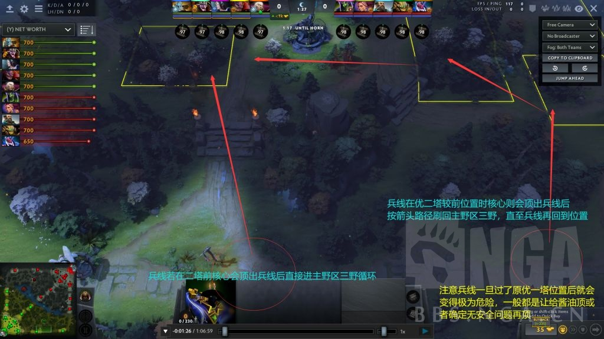
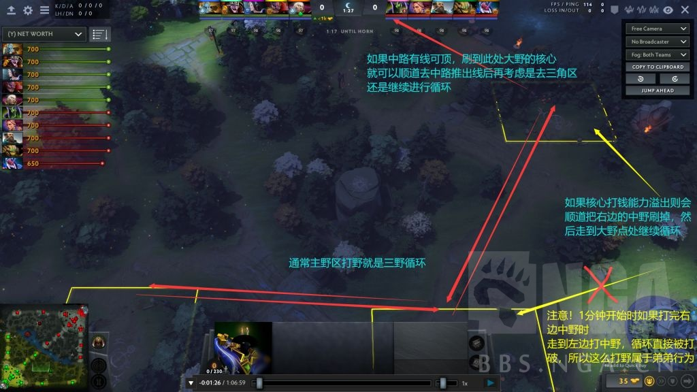
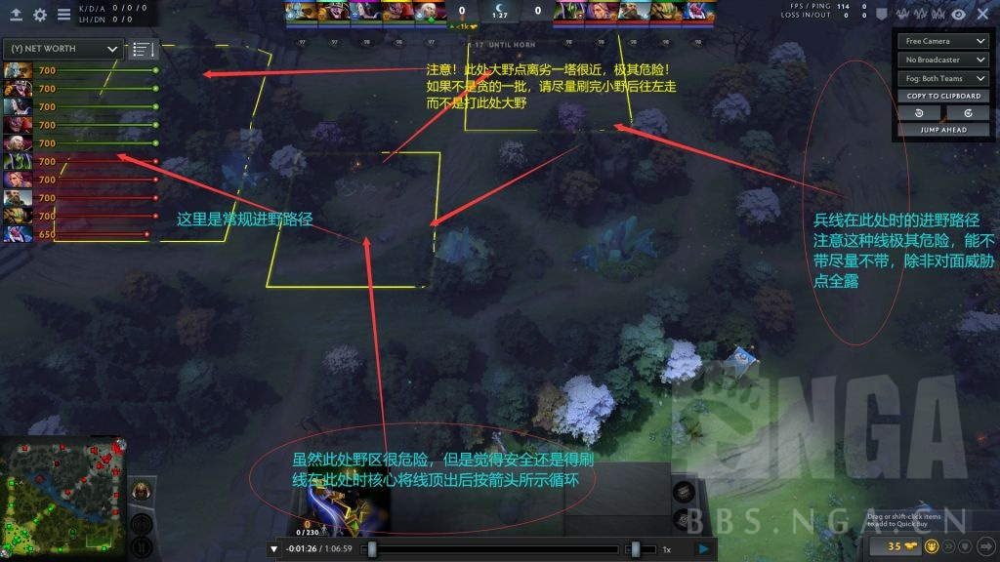
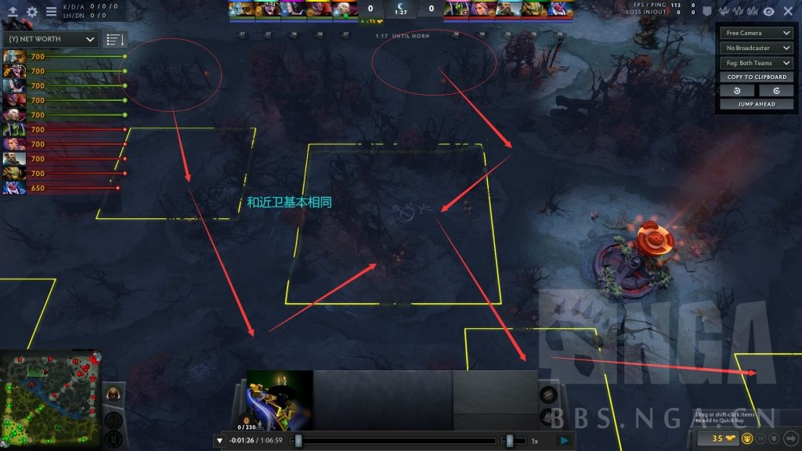
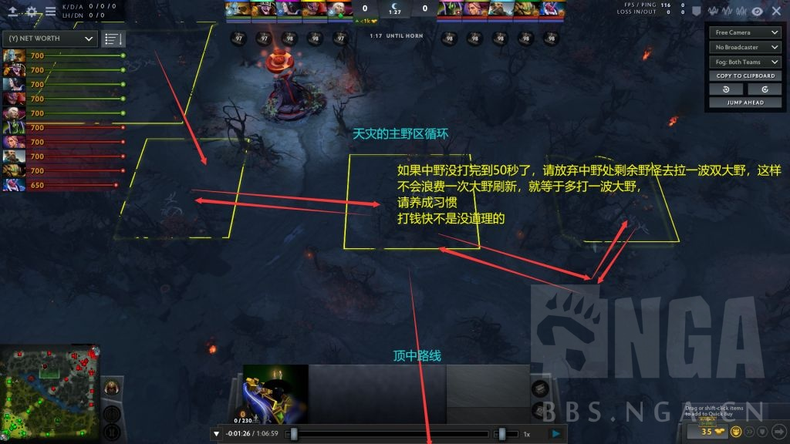
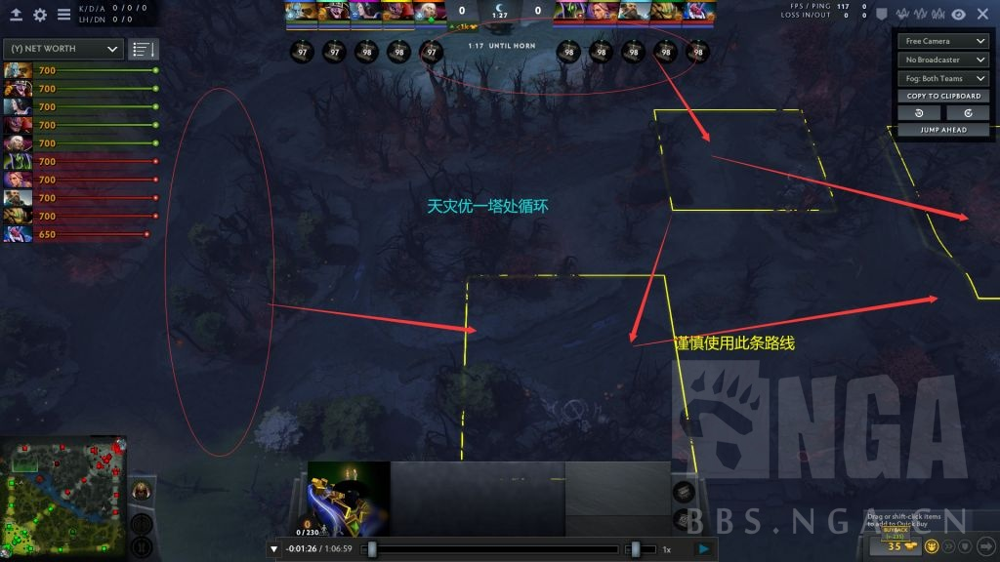
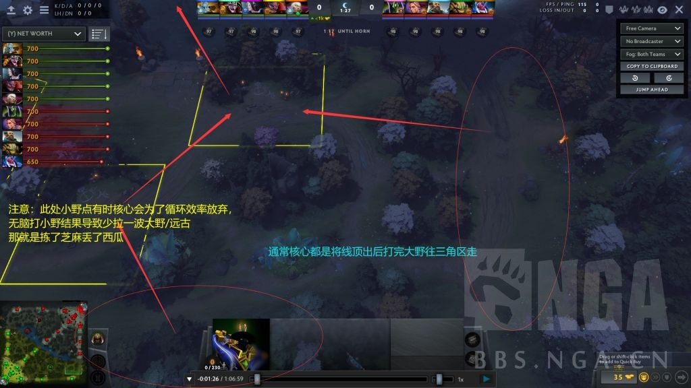
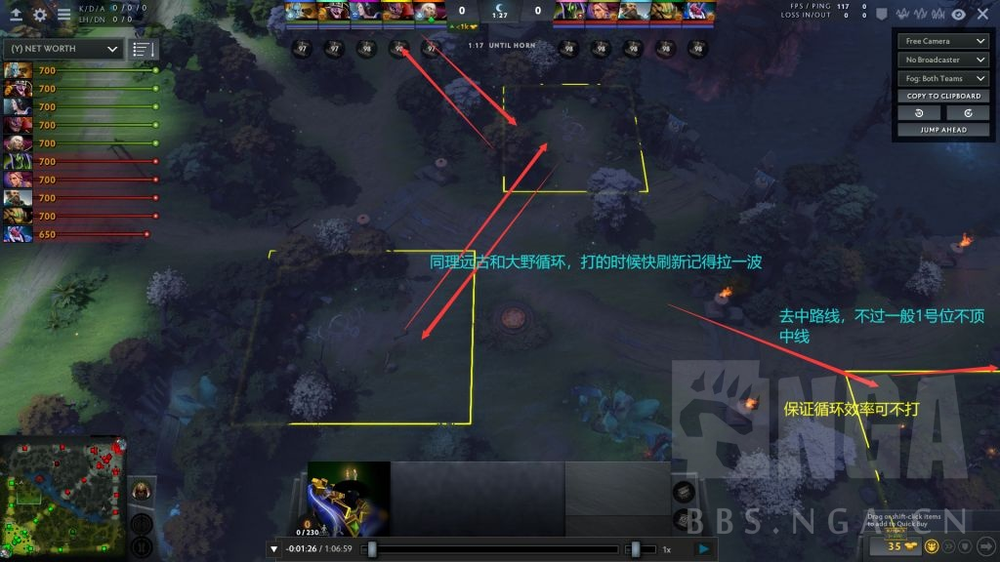
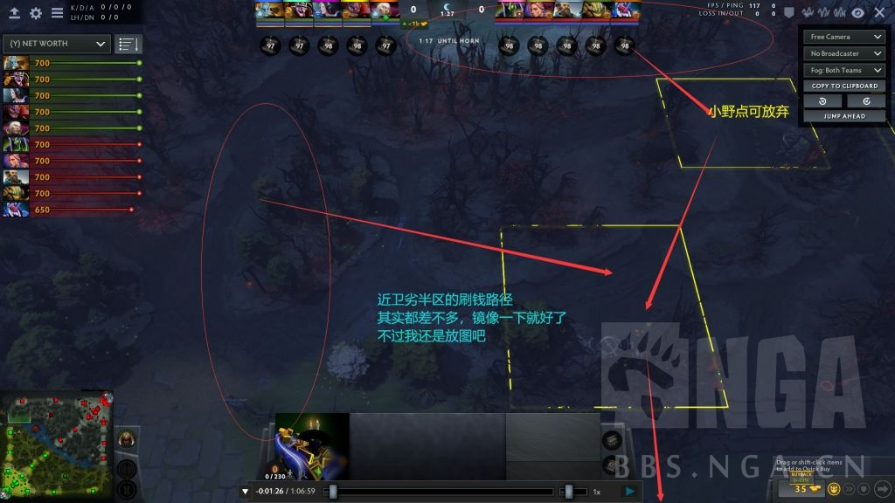

# 手把手教你赢路人--久远Vortex扫盲式中期基础运营攻略

#### 前言，阅读方法

1.本攻略为中期运营攻略，关于边路开局对线和前期运营的两贴已经完结。如涉及到我在前两贴中写过的内容，如兵线和一塔的概念等，我会默认看帖玩家已经掌握。如看帖者未掌握，请直接点我发帖记录去前两贴中查询相应概念。

2.本攻略为基础运营攻略，只讲6500分及以下路人局的前期常见基础运营思路和理解。高分首页局的复杂运营变招乃至职业局高端战术一概不讲(太多太复杂不可能讲完或者讲清楚，有的我自己未必都能get到点)。
不过任何高端战术都来源于洞悉最基础的运营思路产生的延伸。如果大家确实掌握了这些基础，那么在之后OB首页局和职业比赛的时候应该也能比之前更为清楚地看懂高端选手的一些行为背后的意义吧。

3.扫盲式教学指的是我直接给出中期运营所接触到的大部分概念的定义，并且直接再现由

了解基本定义--思考定义的实质--根据实质做出对应运营举动

的思考过程，帮助大家得出整个运营是怎么来的，而不是强行把如何去做硬塞进脑子。硬塞的遥控教学不知含义，记不到两天必全部忘光，我非常清楚。

所以本攻略的适用时效仍然非常久。尽管可能攻略出了不久后版本就会更新，但是如果掌握了思考的方式，那么无论版本怎么改动，你应该都可以第一时间得出新版本属于自己的运营思路。

4.本攻略受众为想提升运营水平的所有位置选手。只要你可以打字或者有麦，团队不知道的决策你就可以主动接管指挥。一个思路清晰的团队大脑能在配合不那么默契的路人局中起到至关重要的作用。我仍然可以保证如果你将贴内给出的定义全部记住并能贯彻到实战中，那你的中期运营保底6000分水平。

对线和前期两贴我加起来写了将近五万字，并且悉数回答了MAX老哥们在两帖中回的每一个问题，也算是圆满了。

想进一步深度提问或者有意找我一对一复盘的可以加我群255742091在群里提问或者私聊我。我一贯是有问必答，群里的老b也是相当热心。
问题只有提出来才会解决，藏着永远都解决不了。(这话我这段时间不知道说了多少次了，问题千万别憋着)
(我复盘教学真的很厉害，吹一波自己，而且我的原则一直是先教，教完觉得有提升再谈报酬，欢迎惠顾哈)

#### 一、前言--看着打？

老实说中期一开始我已经是懒得写了。局势错综复杂，阵容千差万别，有的阵容换掉1-2个英雄可能打法就完全不同，同一个阵容不同核心获取资源量不同也会导致打法不同。那么作为一个面向6500以下全分段的攻略贴如何把这些东西整合到一起写出一个普适的打法是根本不可能的。到最后，说白了，就是是三个字：看着打。

但是这段时间我回答了很多人的问题，并且帮人复盘了不少把，发现很多定义和运营的大方向不少玩家仍没有一个基本的概念。
很多人在某一个时间段处理的比较不错甚至可圈可点，但是过了一段时间，打着打着就开始梦游，也就是“看着打”了。

很多玩家问高分选手该怎么玩，高分的回仨字看着打，他们就真看着打了。

然而高分的看着打显然和你理解的看着打并不是一个程度。

“看着打”是在明确团队运营的大方向下，在具体到某环节时随机应变。毕竟你不可能猜出对面所有人的想法，某个环节可能你确实技不如人或者对面大愚若智把局势搞的莫名其妙。而且，从对面靠买活或者顶级拉扯打赢你眼中的必胜团，到局势大优大哥却被炸弹阴死等等，局势会因为一些意想不到的突发情况走向未知。那么能沉着应对各种出现的突发情况并且迅速调整思路就是高水平的体现。

但是，即使是看着打，对运营方向、英雄特点、强弱势时机、配合与克制等基础概念仍然是需要掌握清楚的。

为什么中期莫名其妙被翻？
为什么本来优势结果打着打着就输了？
为什么感觉自己操刀的英雄渐渐地就打不出想象中的作用？
为什么两边势均力敌结果输一波就没了？
找我复盘的很多人都有类似问题。
进去一看，很多情况下都是没有明白一些比较基础的概念，导致自己并没有清晰地判断出局势走向，或者在某些关键发力时间点开始梦游。可能是1-2个人拉胯拖累全队，甚至可能全队都在梦游。

看着打≠一无所知被迫梦游。

队友梦游本质是不知道该干嘛，只要你清楚，你给了队友方向，他们就会行动起来。

最怕的还是自己梦游。自己都不清楚怎么打，如何带队友赢呢？

所以我还是写一个中期大致的概念扫盲吧。毕竟很多概念，知道了和不知道相比，就是两个游戏。

#### 二、阵容强弱势概念详解

#### 2.1.阵容初判断

在第一篇的2.1和2.3中，我强调过在刚选完人时就要判断自己这条线上4个英雄的对线特点：1级的面板、技能、配合,几级处于强势，再基于对位判断出门装选择。比如打技能多的带魔棒、打消耗强的多带药等等。

当然这只是前期对线内容，而一局游戏中正常对线只占5分钟。那么很明显，只了解英雄的对线特点显然是不够的。

那么我们就得进一步把握双方阵容运营最笼统的一个大方向，再去针对具体打起来的情况来进行微调。

而阵容运营大方向就是5个英雄特性的调和产物。

举个例子吧。

蓝猫tb龙骑毒狗凤凰。
蓝猫是一个节奏感很鲜明的英雄。有大之后的时间带个好F可以强势游走，然后可以刷也可以以战养战，到了紫苑出来迎来最强的timing，之后若不需bKB就走慧光甚至对剑，需BKB就做出BKB打第二轮强节奏。
蓝猫10分钟控了个双倍。此时tb在清矿，龙骑龙刚没，自家凤凰没到6在等着运书。然后自己紫苑差1000出头。
再看队友英雄的特性：凤凰和毒狗都是强反手，但是不能配合蓝猫强势切入，更别说凤凰10分钟没6已经跟不上当前时间的强度。龙骑版本之子对线恶霸但是依赖变龙推塔，没龙全队过不了一塔，而且急需一把跳才能发挥作用。Tb15分钟前基本没这个人，但是能无解肥之后站出来发挥巨大作用。
然后这个阵容最大问题就是缺先手强控，所以龙骑跳刀非常关键。

那蓝猫是刷还是打显然一目了然。等凤凰6，等龙骑有跳或者退一步有龙，等自己紫苑在打。

所以蓝猫的拖着等自己紫苑，等队友有大有跳，就是舍弃了自己前期带F强游走的特性，为了妥协团队的特性。

那这么一个阵容，蓝猫如果选择无脑冲阵，死了两三波，紫苑一直出不来，然后狂喷队友为什么不跟着自己打。
队友怎么跟着打？跳刀差几百还没龙的龙骑和没大的凤凰陪着你一起送吗？

那很明显，这个蓝猫根本没考虑自己阵容的特点，而是被自己英雄的特点蒙蔽了双眼：拿到双倍我无敌，大家跟我随便打。

明明等两分钟有紫苑有跳就是新天地，这个蓝猫就是要干。那么这个无脑莽夫最后只能被狠狠干住，然后还可能成为团队压力制造机制造喷和杠。

这就是，是否明确团队英雄特性带来的不同结果。

这类例子6000以下路人到处都是，时不时高分上头犯病也会有。这时候就需要一个冷静的人站出来指出这时候动手并不是一个好选择，最起码等到龙骑有跳吧。

如何看出来呢？
即使你不玩，也要对每个热门英雄有个大概的了解。知道他们最起码的强弱时期。

哪怕你是英雄勺甚至英雄针，你也得了解。

我也是英雄针过来的，认识我的人都知道我VIS魔怔人，单VIS打了2800盘。但是要知道我VIS打到快2000把的时候都还是四五千分的烂b水平。

是我英雄熟练度不够吗？显然不是。
前面的一千多把我就和很多人一样，无脑堆场次，打一把0提升。时间就被浪费掉了。

几百上千把单英雄“绝活”，但是一看牌子中军统帅的人不更是如此？

我是过来人，我非常清楚。

只有当跳出自己自以为是的绝活误区，去接触每一个哪怕你不玩的英雄的特点，去理解本质，再去回头看你当初的绝活。你自己就会发现，你之前的眼界还是窄了。

只有开始思考队友英雄化学反应导致的团队特性，再去用你的绝活根据特性去配合自己的团队，针对敌方的团队，才能获得水平上的真正提升。

#### 2.2.大致打刷方向

案例1：我对线把对面TB打爆了！他死了两次爬野区去了！他是个菜b！兄弟们这b我之前排到过刷钱刷的贼慢，大家别怕，刷就完事了。

Tb16分钟才分身，太菜了这tb不会打钱，毫无威胁啊。看吧他22分钟才冰眼，真的菜。不对咋感觉团接不过了？完了TB有BKB了打不过了，TB无敌了。你这小鱼怎么才这点装备，你会不会玩啊，这菜bTB都能赢，气死了下一把下一把。

案例2：我中路单杀对面火猫！这火猫太菜了！来一起搞他别停！他0-5了这把稳了！
欸他们家TB18分钟就冰眼了？完了又打不过了，这火猫这么菜也配赢，直接公屏文斗一波，比赛赢了他没赢，比赛输了我没输。

是不是很真实？对刷对干不亦乐乎，对真正威胁点毫不在乎。

是否对刷，稍微动点脑子就可以判断。对面一个无解肥的核要么你们得有个强针对英雄，要么你家的核和他有他相近的经济利用效率并且等经济下能刚得住。
对线无论他打的咋样，你玩个打架核小鱼SA跟对面LUNAtb对刷20分钟，你这局死相会非常难看。你自然而然就不会对刷。

打架方向就比较具迷惑性。

对面确实可能一段时间团战接不过你们。但是你们每波团都是杀掉一个已经死了很多次的2或3，或者杀掉两个辅助，请问他们的死会影响到正常发育的1吗？

而你们被对面拖住了。大部队死刚一路和对面拉锯战，四五个人蹲在同一个地方，团队经济利用率大大降低，大家除了人头只有一条线的资源分。

而放着这个崩盘的火猫单机补两分钟，他能迅速把经济拉到正常水平吗？显然不能。

那你让他一直死有啥意义呢？有时候你们阵容后期不强的情况下tb起来一个人单刷你们全队也不是不可能吧。

结果就是你们仍然要面对一个无解肥的团队支点，而对方被你们打崩盘的核心只需要之后仅凭一件关键装和高等级技能蹭局势即可完成逆转。这样还会沉重打击你的士气：被个菜b蹭局势蹭赢了。

而一个崩盘的23，自然活了就会想办法补经济，这说明了他短时间内不会来继续接没把握的团。

那么只要在火猫无意义地补经济的这段时间你们限制住TB打钱让他们一起变穷，显然你们就确实地扩大了优势。

无脑痛打落水狗导致单核刷20分钟神装宰猪的案例我看的可太多了。

搞清楚最有威胁的点是什么，再决定自己主要的方向。是刷还是打？打谁？不打谁？被表面优势蒙蔽双眼，结果可能就比较凄惨了。

#### 2.3.被忽视的装备时间估算

(以下时间估算全部根据我排到的正常C打钱速度，如果看帖的人自己的C单机打钱速度达不到这个标准请直接移步第二篇攻略的2.3处好好看一下该小节)

在第二篇的2.3中我强调过，一个英雄无论水平多么高，在不考虑人头等特殊情况下，他一分钟能获取的经济总量是有上限的。我当时主要是据此来让大家着眼于如何最大化利用英雄的打钱效率--规划打钱路线。

那么相应地，既然你知道一个英雄的每分钟经济获取量，那么无论是队友还是对面点这个英雄，你都会知道他在一段时间内大概获取的经济是多少。

既然你知道了他一段时间能打多少钱，那你自然也会知道他一件装备大概出来的时间。

那么，此刻看贴的人有估时间的习惯吗？
很少吧。绝大部分人都忽视了这点。

如果一个敌法无干扰单机，狂战的时间大概是14-15分钟。对线很顺有人头则会缩短到13分钟。
很好理解，敌法清不了矿，打野收线得一刀刀A。无论这个敌法多少分，他单机都得14-15分钟做出狂战。
但是一旦有了狂战，敌法打钱效率直接质变。敌法一般会在狂战之后的5分钟左右做出分身。

如果一个TB对线舒适正常进野，那他必然会在13分钟左右分身。如果你插了三角区眼发现对面有矿则会更快。

一个骷髅王如果相位加速手套走HY大概16分钟，加个点金后HY大概18-19分钟。

PL通常是13分钟30。拍拍打钱速度较慢但是对线很容易打出优势收获人头，所以一般14-15分钟吸血面具+30。

版本答案TAluna打钱速度则完爆几乎所有核心，TA可以在14分钟左右魔龙枪暗灭，LUNA则是18分钟左右疯脸魔龙枪BKB。而若野区有大量远古，这个时间段会直接提早2分钟以上。

常见3号位的跳刀一般是在13分钟左右，如果草鞋直接裸会提早1-2分钟。

中单紫苑一般是13分钟左右，裸或者人头多的话提早1-2分钟。

简单举了几个例子，其他的核心想知道的人可以直接去数据网站比如dotabuff拉首页局赛后统计一下该英雄关键装时间。
(我估算习惯是按够钱算，J到货还要运个半分多钟)

可以发现，以上英雄在出到关键装备时或多或少地都会来到自己的一波小强势期。
(敌法这种10分钟开始的铁five出到狂战能带的动线也算强势期，不要觉得打架厉害才叫强势)
有可能luna做出BKB单刷你们全队，也有可能LUNA做出大炮你们无人扛得住一轮爆发。
当你觉得你们阵容无法处理对面的某个核心的时候，他只要按时做出装备，就能轻松获胜。

但是，在做出这些关键装前，所有的核心都需要投入时间成本。他们需要时间获取经济。

如果一个核心死了一次，他光复活就得一分钟。

如果一个核心刷完一轮路线循环发现队友在打他路线上的野，线比较危险又不敢自己收，那他下一分钟打钱效率就会直接降到谷底。

那他的所有装备时间都得往后拖1分钟。

如果他装备时间拖了四五分钟，那他还能打出自己的最强节奏吗？

同样的，如果了解己方英雄关键装备时间，那自然也可以在队友关键装出来前半分钟就可以快速聚集，力求装备一到手迅速出击，不浪费任何强势时间。

估时间也是理解方面基础但相当重要的环节。高分局可不是等3号位跳刀运到然后45稀稀拉拉折腾1分钟才开始抱团，一般3号位跳刀到手一瞬间旁边已经就位的45直接就开5出击。
同时正常选手也会卡对面装备时间去不停地去限制恶心对面不让其一直处于舒适区。

估时间的习惯每一个高分选手都会有意识或无意识地掌握，所以还说什么呢？培养=提升。

关于如何卡时间我之后会写。

#### 2.4.不同装备选择带来的不同方向

众所周知，阵容有蜘蛛一般都是让蜘蛛在一条线上自己玩其他4个人找节奏。
这版本蜘蛛打3喜欢出梅肯+笛子。当然也仍然有走传统紫苑的蜘蛛。
一个蜘蛛，线上很肥，赶人拿塔。他选择了走团队装，8-9分钟就梅肯勋章了。
然后20分钟他这条线上再没出现过一个队友。单梅肯勋章准备补笛子的蜘蛛没办法单杀任何人。
拖了20多分钟蜘蛛完全废了，打团就放个笛子梅肯，没了。然后蜘蛛被队友狂喷怎么这么没用。

一个拍拍，选择了相位吸血30。然后发现肉山处极其危险对面人不露，不敢去偷盾，同时可以配合的队友没一个肯跟拍拍打，大家一起刷。

拍拍单30刷的一点都不快，野区扣野被对面宰了好几次，打到20多分钟基地爆炸对面核心4神装他就一个30一个BKB。这个拍拍也被队友狂喷怎么这么没用。

到底是他们菜，还是确实身不由己？

这就是缺少沟通带来的最大问题：直接导致前期投入几乎所有资源做出来的装备可能一点作用都发挥不出。

一个英雄，他的装备选择不同，带来的强弱势定义和强弱势时期也是不同的。

虽然大家知道蜘蛛可以单通一路不需队友帮忙，但是一旦蜘蛛选择了速出团队装，那么能打架的队友肯定是护在蜘蛛旁边打推进压制，优势路二塔捅完网往其他路铺，占野区压图。

一个拍拍放弃了打钱装备选择了打架装，他必然是积极求战的。所以如果想让这种出打架装的核心肥，那么队友肯定是积极开团配合很早就站出来的拍拍。

例子中蜘蛛和拍拍的队友的行为无疑愚蠢至极。他们可能没有经过任何思考就直接放弃了阵容核心支点的关键装强势期，转而去干一些莫名其妙难以理解的事情，最后再给焦头烂额的队友扣上一顶没用的帽子。

就算你很有想法，你也得事先搞清楚队友的意图。

所以搞清楚自己和队友已到手的关键装的意义无疑非常重要。

出这件装备，到底是想打还是想刷？想打自己/队友如何配合？想刷又如何配合？

最后得出具体的方向。

#### 三、压制运营

#### 3.1.压制的实质

上文中我说过，核心最大经济获取效率是固定的，且实际效率会被抢野/封野/击杀/TPCD等情况拖慢。

那很明显压制就是在己方某一段时间明显强于对面时，让对面的核心大大降低经济获取效率。

但是如何让对面打不到钱，很多人的理解从这里就开始出现了偏差。

如果你单纯想通过不停地击杀某一个人让他独穷，那么实际上很难做到。你们去下路抓死他，他活了T上，你们又跑到上路去抓，他活了又T下，是不是就很搞笑。
他没死几次，你们几个人倒是全都疲于奔命。
更何况他的队友几乎没人处理。

封野不失为一个选项，但是正常人看到1分钟野被封了直接就买真眼排了，你们相当于真眼1换1同时封了一分钟的一个野点。高分局真眼缺的要命，封远古当然得封，但如果你把宝贵的真眼仅仅拿来封一个大野点甚至中野点，效果好不到哪去。
而你单人跑对面野区封野的机会不多，你可能几分钟才能去一次，更别说可能还会被眼看到或者刚好撞到人，那么你甚至封不到一波野。
(低分选手有心封野当然很好，真眼一个50不贵，对面很长时间不排那确实是血赚。我会在下面单开一个小节讲封野。)

下面讲两句废话：
地图上有3条线和主副4个野区这7个资源区，每方正常情况下可以获取其中的5个。
一个阵容有3个核心。

注意，一个阵容有3个核心。

每个核心都需要获取一段时间经济才能真正启动。

设想一下，此时对方接团接不过你们，所以他们的优一塔和中一塔没了，你们三个一塔都在。
你们在他们的主野区。优二塔门口有个酱油在顶线，其他人没露。

那他们的3个核心在哪？
主野区一片黑不敢去。
(关于视野我之后会分一小节)
优一塔没拔你们主野区他们也去不了。
而敌方2个一塔过早丢失导致你们可以轻松把线顶到对方的中二塔和优二塔前。核心敢t优二塔收线可能直接去世，所以这个线一般是酱油顶。中路二塔门口的线一旦前推到河道处，对方核心也不敢继续吃中路线的资源，因为你们可以从敌方主野区直接横插进中路线包对面中路上线的核心。
所以他们只能窝在劣势路线和三角区这一块地方。

劣势路线加三角区，就这么点大个地方，要给3个核心分着用。一个人打，其他两人就没得打了。
那即使你们没有杀掉敌方英雄，他们的经济获取效率也会大大降低。如果一个人全刷，那他们就是单核独肥其他人几乎一点钱没有。每人刷一个野点，那大家就一起穷。

所以压制的实质是，减少敌方可控的资源区，让他们挤在一起蹲着共同贫穷。

就算他们选择了把资源让给一个核心，结果也是1肥4穷，显然比都肥要好处理的多。针对装堆给他即可。

一旦理解了这个实质，你就会发现无脑抓一个人效率低的离谱。如果对面可去的资源区并没有减少，那么即使某个人死了很多次，他的队友仍然有大片资源可供获取。同时被击杀的核心活了就会远离危险地带导致你们得做万米长跑。

#### 3.2.压制的重要一步--中一塔

(第二篇前期运营中我用强调前期优一塔运营，这里就默认你们拔掉了。优一塔都拔不掉的局要么是你们阵容大劣，要么是前期运营出了重大失误。十分多钟优一塔还拔不掉的去把第二篇第六节好好看一遍。)

在第二篇的4.2中，我写了中一塔的定义并配图强调了其为最重要的一塔。

中一塔一掉，你们才能真正意义上的压制，不然顶多是互换野区。

可能是抓死一个核心后直指中一塔，可能是包中，可能是正常强推。无论怎么做，如果你们想压制，一定要把握住每一个可以尽早拿下中一塔的机会。

第二篇的6.4中我着重写了前期包中运营，这里不再赘述。

中一塔一掉，你们就确确实实地控制住了敌方的主野区，同时获得了轻松入侵副野区的能力。

#### 3.3.知己知彼--核心优势路半区刷钱路线

优势路半区范围巨大，可以二分为优一塔旁野区和优二塔旁野区。

一个核心如果没有像我在第二篇5.2中说的那样换到劣势路打钱，那么他只能进行优势路半区的经济循环。

下面分别放上近卫和天灾的路线循环。

近卫优势路半区循环如下

天灾优势路半区循环如下
注意黄字重点

#### 3.4.知己知彼2--核心劣势路半区刷钱路线

劣势路半区最大的资源点就是远古了，能利用远古的核心必优先打远古。

远古矿只有TA和SV可以超高速清完，其他诸如luna，med潮汐等英雄虽然有清矿能力但是效率并不高，所以如果选择清矿就放弃了所有兵线和野区循环，待矿清完后再进行循环。

在没矿的情况下，正常核心会以远古野点为中心规划循环路线。这里我也放一下大概的路径。

#### 3.5.主野区压制

既然我们了解了压制的实质和核心的刷钱路线，那么想去针对也不是难事。

很显然，除非团队有意战术蹲人，核心一个人在远离防御塔的地方被干真是叫天不应叫地不灵。那么核心自然会追求在可控区域安全高效地打钱。

在第二篇的第四大节中我详细图文解析了优一塔和中一塔的定义和作用。

一旦优一塔丢失，那么优一塔旁野区距劣一塔非常近同时无任何TP支援点，自然危险至极，核心完全不敢在此处获取资源。

同时优一塔丢失后，主野区变的不再那么安全。一旦核心在主野区被动手，要么队友得T中一塔或者优二塔跑十万八千里，要么得T锅5秒钟，大部分情况下都来不及。如果T锅，进攻方还可以在TP过程的5秒内自由选择是强行击杀还是直接撤退。

那绝大部分核心，尤其是1号位，在主野区打钱也比较危险。因为队友不可能时刻蹲着1号位，队友要配合23干事，一般都是放1号位单刷。那么除非你预判蹲，基本1号位在主野区被动一次就死一次。

所以敌方自然打钱区域就会大大缩小。

同时主野区旁的优势路线若己方一直有人顶，那么兵线就会时常处于优二塔里。
不仅仅兵线会消耗优二塔血量，同时优二塔也会砸掉小兵造成一整条兵线的资源浪费。那么劣势方必然会分一个辅助吃优二塔门口的线以利用团队废弃资源。那么显然，辅助明牌露在优二塔，其他地方就必然少人。那么进攻方就必定是多打少。如果是单核心贪兵线TP收线，进攻方可以自由选择直接塔下强杀该核心或者打一波必胜多打少团。

而中一塔丢失后，主野区几乎失守。在防守方无视野的情况下，进攻方可以随意开5经敌方主野区至中二塔前直插三角区，或者开5直接回己方主野区。同时若己方一塔未掉，一旦敌方核心敢贸然单人推一塔或进野区，进攻方可以从多个TP选择点处tp至阴影处直接回防打一个措手不及。

这一切都是霸住敌方主野区的衍生利益。

所以看帖的人以后不要再在己方前期战斗能力明显占优的情况下退回自家区域互肥了，完全放弃压制能力而无脑追求互肥真的很蠢。

那么接下来就是提一些压制的具体内容。

#### 3.5.1.压制视野

如果己方点亮了敌方主野区，自然敌方核心一旦出现在主野区第一时间就会被发现，此时就可以轻松定位抓人。
如果敌方主野区一片黑，敌方根本就不敢来主野区打钱。他们的资源区就会减少。

但是如果敌方在主野区有视野，那么他们就能清楚地看见进攻方在主野区到底有几个人，到底想干什么。

那自然，排掉敌方视野，并且做好己方视野，就是压制的一环。

看到这里的人估计以为我要放眼位了。

我也想过放不放，想了想还是不放了。

一个是此攻略我不想做成个短时效攻略，到这个月底新版本一出之前眼位可能要废一大半。

另一个就是，我希望看帖的人能得出自己的眼位。

可能有人会觉得我写的东西只要照着抄就会变强了。确实，很多概念，平时不会有意接触，所以知道和不知道就是两个层次。

但是我仍然希望看帖的人能通过自己的思考得出属于自己的运营方式和对局习惯。所以我三篇攻略的每一处都是避免使用祈使句叫你们干什么干什么，而是尽可能写理解--从概念，到思考过程，到结果。

看得人可以在确实明白并了解了大方向的情况下，结合自己的实际分段，结合自己平时的习惯，对自己进行一个补强，而不是抄个作业完事。无脑抄肯定记不住，而不知本质可能会被打的非常凄惨吧。

这里压制眼位我只给出一个要求：哪里需要视野就在哪里点眼。

你觉得敌方核心会频繁TP二塔进主野区，你就在敌方优二塔门口点眼。

你觉得想包中，就在对面中一塔后做一个塔后眼。

你觉得敌方想守优二塔，就在优二塔后点眼。

你觉得敌方有意排高台眼，就不要插高台插偏一点。

你觉得己方能强势压住此片区域不让敌方过来排眼，那你就可以大胆插高台。

没有不按教学眼位插的眼就不对的说法，只要能获取到关键讯息，这个眼就是好眼。

排眼就是，思索敌方可能的防守眼位置，利用J的高空视野反眼。

排眼和插眼本身就是博弈的过程，水平越高，博弈的次数就越多。

具体眼位首页局每一把到处都是，随便蹲一把就能看到。我放图属实没意义。

自己去得出属于自己的眼位，记得肯定比我放图塞给你们牢多了。

#### 3.5.2.利用敌方主野区资源

野一分钟就刷一波，打完就没，那么自然你打完了对面就打不了了。

为什么高分C都喜欢在对面野区打钱呢？

在压制局面下，己方打架能力显然高于对面。

劣势方自然不会坐以待毙，稍微一有战斗力就会想法冲入敌方主野区寻找多打少的机会，此时单人在主野区打钱的C就会寡不敌众。

在分析了主野区特点后可以得出主野区在优一塔被破后较为危险。他们知道自己的野区遍布对面视野或者埋伏者若干，那自然在对面不露的情况下不敢贸然进入己方主野区。

所以，敌方主野区安全性>己方主野区。

既然是安全区，只要有一个保护眼，那么核心就可以在此高效利用资源。

低端局不开5,对面一进主野区就被眼看见，那么己方就可以自由选择是打还是撤。

对面开5强行打己方主野区怎么办呢？很简单，团队分一个辅助站大哥前面破5即可。

辅助撞到5吸引火力，核心直接安全撤退。就算死了，对面一个5只能抓一个辅助，是血亏中的血亏。

辅助破5而死，就死的很有意义。换掉一个5，同时保了核心不间断获取资源。

而自家核心刷完大部分资源走了，剩下的资源就归辅助了。辅助可以打新刷出来的野，可以持续将线顶在二塔门口。辅助也不会穷。

个别特殊辅助比如剧毒/POM等英雄，可以深入敌方最深处的野点打掉大怪让对面毫无脾气。

这么一占主野区，己方不仅压制了对面，还获得了更多的资源。

很多选手觉得自己没地方刷，这不就有地方刷了吗。

所以不要觉得没钱打，全地图都是钱，只是你能不能利用得到而已。

#### 3.5.3.破优二塔

优二塔显然并没有优一塔那样对前期运营至关重要，但是拔掉它仍有不小的意义。

优二塔除了塔的共性外有两个关键特点：
1.主野区的锅是否可占。
一旦优二塔告破，主野区的锅被占，情形会更加恶劣：己方主野区无任何TP点，而敌方多了一个TP点可以迅速支援。
那这个野区到底是谁的？

2.兵线是否经常处于高地门口。
只要有人推了一波兵线，兵线就会一直往前推。所以一旦没有优二塔顶住兵线，兵线就会直推到高地门口。

你们打架打着打着发现一波大线带辆车子跑你家高地门口开始砸高地塔了，可能车子旁边还站了个飞鞋lina或者ts搁着炸塔，或者小y插了个蛇棒，你们还敢继续恋战吗？

没人交TP可以啊，高地都要没了，什么样的高端运营高地都能放掉呢？是打算赢了这波团直接一波基地吗？

一旦有人蚌埠住了立刻交TP，团战瞬间减员。

这可比被对面杀死还要严重，被杀了还能买活T出来，T走了，这波团是不可能再来了。

同时，高地塔的攻击非常高。一波大线防御塔砸几下兵线就没了，你们就亏一波大线。此时兵线弹出至危险区，你们又不敢去了。

所以在压制主野区的同时，持续消耗优二塔血量也是要务之一。当然如果敌方守塔较强，强行集合拔塔可能会翻车，所以一定要搞清楚此局的优二塔到底适合慢慢磨还是集合一次拔掉。

#### 3.5.4.封野

封远古不谈了，基本中的基本。这里主要讲封主野区的野。

低分局可能对真眼的利用并没有那么到位，所以商店会经常有大量真眼存货。那么把这些存货利用起来封掉对面的野自然也是一个不错的选择。

这里你选择全封也不是不行，但是你能全封对面就能全反。然后你会发现你没真眼了。

就很尴尬，有时候只能断1分钟的刷新，那用掉三四个真眼可太亏了。

所以封野一般是针对敌方野区循环。封掉最关键的野点，让敌方花更多时间跑路而不是打钱。

我之前已经放了野区循环路线图。那么封野只需要将三点连线中的中间中野点封掉，并且封掉一个大野即可。

你会发现封了之后对面的核心打个野一分钟得把整个主野区跑一遍，并且只能打1中1大，同时没时间收线。

大部分时间都花在跑路上了。

而你只用了两个真眼。对面排了你下次还能封。

效率是不是高多了？

当然高分局不建议无脑封普通野点，真眼太重要了，断真眼难受的要死。

#### 3.6.判断并阻碍对方关键装时间。

之前我写了如何判断敌方大概经济和关键装时间。

一个蓝猫紫苑差500死了，蓝猫活了是选择打架还是选择把紫苑打出来？肯定刷出来紫苑再打对吧。

这时候优二塔门口正好有一波线，蓝猫T不T？

蓝猫这种英雄仗着自己生存能力好，即使有些烂线也敢肆无忌惮地顶，顶完我就跑，你们来不及抓我。

但是如果他t下来收线的时候旁边有3个大汉开着5顶着这张TP呢？他还能跑吗？

蓝猫10分多钟出头复活将近一分钟，够你们组织再动他一次的时间了吧？

这就是一个非常典型的思路：断展开。

(最近dl打多了，断展开这个词我觉得就很能描述。无底陷坑为什么是神，对面一下怪准备展开就被你盖了，对面就只能空过。再想想对面差几百块钱关键装结果TP死读秒还得再出去打钱，是不是也等于空过)

一旦蓝猫TP死了两轮，他们的最关键和最强势的节奏直接被断。如果全队都特别需要蓝猫紫苑先手或者切关键英雄，他们会直接萎个三分钟以上。还有比这更好的事情吗？

如何判断这种运营，这就需要具体实战经验了。比如蓝猫刚运到2根棍子之后就死，或者假腿1根棍子12分钟左右死，那么他就大概差1000不到紫苑。敌法大剑坚韧球刚到手肯定差1000狂战，如果指环大剑有段时间没运装备，那可以估一下大概1-2分钟狂战。核心身上有个斧头，大概1000-2000BKB。有斧头+锤子，大概2分钟后BKB到手。

等等等等。

这个不同局完全不一样，真的只可意会了。我这里就是给出一个方向，具体如何操作大家可以结合自己打的具体情况来。有的低端局蓝猫单机15分钟都刷不出来紫苑，那你的时间就可以相应放宽一些。

#### 3.7.肉山盾的定义和运营

这一个月很多人找我复盘，我也在有意总结不同分段的一些共性。

几乎所有找我复盘的选手，他们输的局几乎都会出现两个重大共性问题：

一个是优一塔能推迟到15分钟以后拔，最长纪录是45分钟对面优一塔没掉。
(优一塔定义和作用以及拔塔运营我在第二篇中已经详细说明，这里不再赘述)

另一个就是打到天荒地老也不知道控盾。一代盾20分钟前是绝对不碰，30分钟随缘可能想起来了就去打一下。有拍拍或者TA还好，但是我复盘的局有人即使选了拍拍TA还是不控盾。

结合这一年总体观察，我可以说，6000以下选手，基本不会将肉山盾纳入己方运营中的一环。

对肉山盾的理解成为了区分水平高低的一个分水岭。

#### 3.7.1.肉山盾的定义

一代盾让你有两条命。
二代盾的魔晶让某些魔晶很强但是优先级不高的英雄质变。
三代盾无论刷新还是A杖都是强力装备，并且打完就送，相当于为己方核心下拨团瞬间多了4200或5500的实战经济。同理，原先A杖强力但优先级不高的英雄直接质变，想一想PUCK出的林肯飞鞋大炮，直接多个A是啥概念。刷新则是团战毁灭者，刷BKB魔免12秒以上或者刷战术大招都是毁灭打击。

这里只详写一代盾的作用。早而清晰的前中期运营自然比模糊的后期看着打更能让人提升。

肉山盾最大的作用是，保护己方核心不因各种突发情况去世，从而保证5分钟内的下拨团战必胜。

很多情况下，你们的优势压制都是依仗于某核心此时强而有力。

但是强而有力的核心可不一定生存能力也很强。一个魔龙枪暗灭的TA很难杀吗？跳刀都没有就一木桩子，几个人过去TA必死。

如果敌方选择倾全队之力秒掉你们的核心，或者趁核心单人顶线或者队友没护好杀掉核心，自然你们就不再能压制。核心读秒中，己方被迫回撤等其复活，那么敌方就会将你们的压制眼位全部排掉，点好防守眼，把线推回去。

那下一轮从头再来压制的时候已经过去了两分钟，你们又得重新组织压制。

但是线已经过来了，眼也被排了，对面眼不知道插哪了，很可能你们再次入场时底裤都被看光了。

那你们如何压制呢？

但是如果关键核心带个盾，就能保证自己下拨团基本稳定不会死。对面10-20分钟是无论如何都秒不掉一个两条命的无解肥核心的。

这就是为什么TA拍拍强势的原因。一个魔龙枪暗灭的TA或者一个单30的拍拍很容易被集火光速去世，但是如果他带盾，下拨团无法被秒杀，就可以稳定安全地持续打出爆炸输出。

对面劣势方根本无法抗衡，只能龟缩或者猥琐带线拖到5分钟盾消再打。

那么己方就可以在5分钟内一直持续压制滚雪球。

同时，很多本来不好上的高地，带了个盾显然就好上了。

核心不会死回去读秒导致压制意图破产，同时解锁上高选项，就是一代盾在压制方面最大的作用。

这就是高分常说的带盾压制和带盾上高。

#### 3.7.2.压制控盾

对面接团接不过被迫龟缩防守，己方占尽优势，那自然想利用肉山盾进一步扩大优势。

这时候的控盾就是明摆着的事，告诉对面：我们打盾了，有种就来接肉山团，我们等着！

对面不敢接，那己方平稳得盾，于是乎优势被进一步大幅度放大，优势就转变为了胜势。

对面选择铤而走险，那么己方已经做好视野，就地开团以逸待劳，追求灭团+拿盾。那基本就直接等于赢了。

压制方一定要对盾有想法，打不打是你权衡之后的结果，而毫无想法就是水平较差的体现。

这里说几个点：

1.控盾要求打盾速度最起码在40秒内，不然实在太拖还是不打为妙。特殊控盾英雄如拍拍TA神灵自然可以轻松单人高速打盾，出暗灭的物理核如pa小骷髅配合一个能顶的队友可以高速打盾。而正常发育的物理单核在20分钟出头可以稳定拿盾。同时大鱼老奶奶等英雄并不能单人打盾但可以高效辅助队友打盾。

2.提一些普通选手不会注意的英雄：
分身幽鬼。幽鬼出到分身就有了快速控盾能力，高分局早成常识但是低分局仍未普及。
VIS两级龙带勋章配个能顶的和一个副输出手，在20分钟前即可快速控盾。
队里有滚滚可以极大提升打盾安全能力，打盾血量消耗会大大减少。
常规物理单核都有打盾能力，但是PL敌法剑圣这三个常见核心打盾效率较慢，不是对面多人团灭无力接团一般不会考虑小优就控盾。
电棍大招对肉山无效哦，潮汐锚击对肉山也无效哦，别傻乎乎的放技能了哦。

#### 3.7.3.无盾不上高

团灭对面上高是废话我们不谈了，考虑的是对面战斗力仍在的情况。
此时上高未必并不是一个好选择。
有的阵容可能前期崩的彻底，但是守高有剧毒宙斯卡尔蓝猫等高地战神或者拥有多个AOE可以迅速清兵，那么正常兵线一瞬间就没了，己方大哥就得抗着塔拆迁。

这样核心就会被高攻击的高地塔疯狂消耗血量，未战先衰。
而上高团是最容易被翻盘的团战，很多人觉得自己无敌了，结果高地团队伍一浪阵型一散直接被对面反打团灭。
然后，对面控盾。

这时候的大优势可能直接就扭成了均势甚至劣势。那这样，自然是优势方不想看到的。

所以，带盾上高磨塔，两条命就耗得起，上高团也更好打。

退一万步来说，你们带盾被团灭了，肉山此时正在刷新，对面就不会带盾进一步扭转局势。

所以，除非对面团灭你们无压力破路，或者对面大哥确定买活死，

否则，无盾不上高。

#### 四、劣势运营

#### 4.1.拒绝JD--心向希望

第三节我们着重写了己方作为优势方如何去有效压制对面。

但是不可能每把都前中期优势稳定压制。如果你们的阵容确实前期较为乏力，或者某路崩盘崩的离谱，再或者对面团战特化过于强力，你们都会陷入劣势局面。

一般看首页局多的人的时常能看到快速公屏基地下一把，也没有队友内讧，就是到点了快进。

首页局的压制力非同凡响。如果开局阵容大劣，或者两路以上崩盘，并且肥的那路不能在前期站出来，或者确实有买号选手，那么局势基本就难以挽回了。

会玩的敌方可不会给你任何机会进行反扑。首页局的压制力看得人应该都比较清楚。他们会用自己熟练的压制技术，将对方直接狠狠压制到根本无还手之力。
这时候一般高分玩家看懂局势后，知道确实回天乏术。因此他们选择不浪费时间坐牢，快进到下一把可能出现的高质量对局。

但 是！

首页局对局强度带来的高压环境，和普通对局的环境可是天壤之别。

请扪心自问，6500以下的局，敌方的压制力真的有专业到完全玩不了吗？

并且，打JD的红地球玩家或者职业选手看懂了局势已经无可挽回，看他们打的人可没有。

结果是很多人看主播或者首页局玩家敲JD，然后就是，既然高分男神敲JD，那么我学一学，自己打的时候一劣也敲JD。流行的JD就是这样带到了大部分其他分段的对局中。

结果就是，明明特别容易翻盘的局，被几个“男神”敲了JD，然后直接队友不打了。

你的理解让你觉得局势无可挽回了，有没有可能实际上仍有大把机会可以转劣为优呢？

如何发现这些机会呢？那自然是提升自己的水平。

那么一劣就敲JD能提升自己的水平吗？

话说回来，如果不是内讧JD，对局如果仍有一丝希望，高分玩家仍然会不懈地拼搏到基地爆炸前一秒钟。有时候敲了JD发现还能打，也会果断继续守下去。

这就是所谓的“诈降”。

不是阴险狡诈。单纯地，只是还想拼一波机会而已。

说到jd，职业比赛也是如此。公屏gg10秒后基地自动爆炸，属实是高配jd了。

为什么有的比赛十几分钟就敲GG了，有的比赛大劣方却能守到天荒地老？

因为，职业选手不会放弃每一个翻盘的机会。只要有翻盘的希望，就会坚持到底。

某些看比赛结束得快 就喷吃了，比赛结束的慢 就喷硬憋的人，望你们好自为之。

所以，不要再抄首页局JD了，请把握住自己的对局的一切希望。

6500以下的一切对局，只要队友没有A装备，

那么，

希望必定藏在荆棘之中。

(嘴欠挑事对喷jd的你开心就好，我可不想教牛二，牛二自有杨志磨)

#### 4.2.看清劣势的实质

劣势自然有很多种。不同的劣势自然可以对症下药，但前提是你得搞清楚你们究竟为何而劣。

1.对线打的很难受=崩了，玩不了了，JD。
是不是很经典，正常人都碰到过这种情况吧。

对线打得很难受很有可能是队友抠脚，也有可能是对方英雄强力，对线确实难打。

对线只占5分钟。如果详细地看了我的第二篇帖子，和此篇的3.3-3.4打钱路线，那么一个正常智商的核心，即使对线难以对敌，在对面压制力普遍羸弱的低压环境下仍然能轻松地获得资源。

一个核心的抗压能力，不是他对线劣势怎么怎么样，而是他在整体的劣势局势中仍然能够有效地利用资源。

那么你会打钱了吗？还不会？不会还不赶紧看去！

2.根本打不过对面，赢不了了。
这这种描述就非常模糊了。

一个阵容可以有多种因素导致打架强力。
可能有蓝猫火猫这种前期高爆发节奏点。
可能有伐木机这种前期有可能全队过不去的存在。
可能有夜魔军团末日这种小节奏王者。
可能有比如潮汐猛犸虚空凤凰这种团战霸王。

但是，一个阵容只有五个英雄。

你点了3号位潮汐以求团战爆炸，那么伐木机就不会3，伐木机可能去中，那么中路就不会有火猫蓝猫，那么这个阵容就会丧失灵活的机动节奏点。

你点个WLK力求团战艺术，结果对线可能就打一个互肥而非压制，让对面的3号位很肥。

发现了什么？阵容无论怎么配，都有优势和短板。

对面靠强力大招，那么就放对面赢一波小团，对面大招CD再去进攻。

对面抓人强力，我们可以靠谨慎判断减少出事率，并且可以反蹲。

对面五人抱团无敌，我们可以靠带线拉散。

6500以下的局绝对不存在十全十美毫无破绽的阵容和运营。那么多去思考对面的短板究竟在何处，就是平时最需要培养的习惯。

3.队友不会玩，太难打了。
严格来说这种劣势不算运营劣势，不过我还是说一下吧。

队友不会玩，你会玩，就可以了啊。
很多情况下的队友梦游都是队友不知道该干嘛。
你给出一个明确的目标，他们就知道该干嘛了。
就蹲我这波线。
就在这个地方点一个眼。
打架一定要把这个技能给XXX，别的一概不用管。
你就切xxx，其他的我们来处理。

前提是，你一定得清楚，得明确，如何去打。

很多人觉得自己一直在说，队友一直不听，是因为自己说的方式实在是过于粗枝大叶。

辅助你做眼啊！你技能放好点啊！大哥知不知道切入啊！技能别乱交啊！

我没放任何阵容局势和英雄，我就这么一说，你能听懂我在说什么吗？怎么就叫放好技能或者切入了？

别人听不懂，你搁着怒气冲天，又有什么用呢？

本来劣势就不好打，你还给压力，别人不仅不听可能还会跟你喷起来。

多长点心吧。

当然真的有油盐不进的人，那排到了确实没啥办法。如果说的如此明确还不听，那确实就不是你的问题了。

这种人毕竟占少数，所以培养自己的沟通能力还是比较重要的。

#### 4.3.带线打散

5个人，3条线。
对面多人抱团己方难以应敌，但是5人能同时抱团出现在3条线上吗？

对面五人明牌抱团推塔，或者视野里少个不带控的英雄。

意味着其他兵线和野区没有任何人。

劣势是劣势，接不过是接不过，碍着你带线了吗？

直接将兵线顶至敌方塔前，有一塔去拔一塔，没一塔更好直接顶到2塔门口。

对面大部队刚开始推你们的一个二塔，结果发现你们的一个核心比如LINA或者小骷髅在狂A对面的二塔。

对面不回来吧，对面抱团推掉了一个二塔，你们一个人就推掉了一个二塔。
本来对面优势却打成了一个换二塔的局面，谁亏谁赚一目了然。

对面蚌埠住了TP回去，那敢情好，正面战场直接少人。

你们带线过去的英雄TP可没有用，直接T回来，是不是就是多打少？
五人齐打不过，多打少我还打不过吗。
如果对面TP回去的同时放弃进攻二塔，你们是不是就守住了这波攻势？

当然对面可能不是在推塔，可能是在你们主野区抱团压制，或者是开5刚进你们野区找人。

是不是结果是一回事？都是匆忙回防二塔导致人员分散，然后你们即可主动出击多打少。

劣势方最最基础的运营思路就是通过带线逼塔打散敌方从而创造机会。

#### 4.4.辅助正确送人头

对面强势压图扫眼，外塔掉差不多了，地图一片黑，你们不敢出去。

那5个人一起蹲高地挂机给对面狂刷，那基本到点了，资源只有推过来的兵线，而对面越来越有钱。最后就是坐以待毙。

这种情况一般两种选择，一个是开5强行出击搏梦想打对面一个措手不及。
高风险，输一波通常直接到点，当然同时也有高收益。
不过这个我没必要教，是个人都知道。

另一种选择就是，让未知的恐惧变成已知。

对方核心处于阴影中，己方核心就不敢出去打钱。

那么，只要能看得到对方核心位置，那么其他区域自然会安全许多。

那么敌方核心怎么露位置呢？

让辅助牺牲吧。

高分局的辅助有时候劣势局kda缺不错，会0死，1死。
这并不能说明辅助多会玩，恰恰相反，可能他不会玩。

辅助出去无脑顶线，顶到很远处被敌方核心击杀。辅助奋力反抗拖延时间，最终被击杀。

确实，这是送人头。但是，送的太有意义了。

敌方1-2个人包括核心出现在上路击杀己方带线辅助，意味着下路区域虽然一片漆黑，但是对面必定少人。

此时己方就可以直接出击把此区域的敌方视野反掉，并点好己方视野。
眼一共就那么多。这么一折腾，对面的眼就耗了一两个。多来几次，对面的压制视野就被排差不多了。

视野都没了还怎么压制呢？

这样，劣势方的生存压力就会大大减小。

同时己方核心可以放心地走出去带线打野。
你家大哥怕被蓝猫飞死，蓝猫都露了还怕什么呢？

这就是高分常说的，打信息。

辅助确实送人头了，那又怎样？我有买活，打起来我还是可以买活参团。

另外一种必要的牺牲就是辅助给核心断后而死，不过我也没必要讲，没啥要点。

最主要的就是，劣势局，辅助一定得不怕死。大胆出去送，给团队创造排眼和获取经济的机会。

当然请不要把打信息当成你无脑送人头的借口，有的时候你送就是菜，别装模作样地说自己在打信息，你是不是打信息你心里没点数吗。

#### 五、团战要点

写完优劣势运营，你们应该会觉得我要开一节均势运营了。
但是说实话根本没有均势运营。

任何阵容都有强弱势时期，有长处和短板。怎么可能恰好找出一个均势，基本都是事后诸葛亮看着好像两边经济差不多就叫均势了，别说有的阵容经济落后八九千还能追着对面打。

你在打的时候，怎么可能知道你们是一个均势？

所以根本不存在均势运营。

所以我这一节讲团战。

#### 5.1.明确双方核心英雄

这里所说的核心就不是123号位了，而是对此次团战最能发挥作用的英雄。
比如你们想秒对面，但是对面后面站着个神谕。
比如你们以想打拉扯，但是对面大鱼带狗就是想跳秒你们。
比如你们仰仗DP开大推塔，但是DP一旦被秒则会作鸟兽散。

神谕是核心吗？不是，但是对面会先手神谕。所以队友可以围绕神谕互救。

那么明确了核心，你就会明白该如何行动。利用好己方的团战核心，限制敌方的团战核心。

如果你思路不明确，那你自然就中了对面下怀。谁先明确了双方关键团战的核心要点，谁就取得了团战的先机。

#### 5.2.团战视野

一句话，在有视野的地方打。

团战没视野怎么打？根本打不了。

团战一定要保证视野，不然可能崩的会很难看。

那如果是主动冲击对面无视野的地方怎么办呢？

低坡冲高坡，必立刻就地点高坡/高台眼。

把点眼当做一个技能来使用。

虽然眼会直接暴露只能存活于此次团战，但是这个眼提供的视野直接关系到团战是否胜利。

#### 5.3.站位

判断完两方团战核心英雄后，自然对自己的定位有一个大概的了解。

所以，你可以判断出，你到底能不能先死。

尸王这种英雄，墓碑立出来，脸滚一轮键盘，就可以去世了。所以尸王可以走前面卖。

但是如果墓碑立出来与否直接导致团战是否胜利，那么尸王就绝对不能被对面先手秒掉导致放不出墓碑。

那么两种不同的定位，就会导致尸王两种不同的站位。到底是一马当先吃技能，还是躲后面不第一个上。

这就是站位，本质就是，明确自己在团战中的定位。我需要做出什么，我就一定得做出什么。

做不到，就是站位差。本质就是思路差。

所以，站位仍然是需要你去结合具体局势思考的内容。

我只举了一个例子，不同的英雄，不同的局势，自然站位也不同。这就需要各位自行判断了。

5.4.技能释放/装备使用
很多人打团就把技能放出来放到人就觉得自己完成任务了，标准内华达单线程是吧。

结果就是大招被推推躲了，紫苑被吹风解了，一套技能猛如虎，盘子触发250。

和上一小节一样，技能装备的使用，本质还是是清晰明确自己的作用。

我IO梅肯+挂坠连着核心，有时哪怕4号位或者3号位在我脸上被活活打死，我也绝不会断链子去连他回血。

看起来好像很绝情。但是有的时候我就会做出如此判断。

我连的是luna，luna没有BKB，luna只要站住就能赢团。

那么我手里的一切抬人装备全为luna存在。如果我贸然连了我家4号位，链子直接进CD，梅肯只能回300血，结果是我好像抬了一下队友血量，结果luna被秒团战溃败。

到底是为了赢团，还是单纯走个过场按一遍技能装备？

时刻保持最清晰的思路，才会在混乱的团战战场上稳定使自己发挥最大的价值。

#### 六、装备

100多个英雄，几百种出装，还得看局势，我不可能一个个列出来。

一个英雄的大概常规出装你们应该也都清楚，不清楚的直接找首页局看就行了。

这里只强调最重要的一点。

跟风潮流的时候，一定要搞清楚为什么这么出。

相当多的人喜欢跟风抄，首页局出啥我出啥，不管阵容不管局势不管选手理解。

典型代表LUNA的ame四件套：魔龙枪BKB大炮魔晶。

确实，这套已经普及成为了主流打法。简单无脑易上手。

显然魔龙枪BKB大炮简单粗暴，但是刃甲分身(可能有冰眼)的幽鬼拖到你BKB结束直接开大刃甲飞你脸开分身，请问你如何接敌？旁边无友方单位荒芜三倍快乐，你暴击一下看看自己先掉多少血，别人幽鬼还有折射。

所以在对局幽鬼时这套出装反而发挥不出理想中的效果。

如果对面是一个正常发育甚至偏肥的幽鬼，你还无脑走这个四件套，你可能会死得非常难看。

这就是不知本质的体现。

另外，很多高分局的出装可能看起来比较魔幻，因为这是别人带着自己对当前局势和阵容的理解做出来的装备。

注意！
并！不！具！有！普！适！性！

我前两天拿VIS打3，前期局势大劣，我方pa崩盘，于是我勋章后直接裸赤红甲，裸之后只死过一次，顶到极致。

不少人学我VIS，但是如果有人看我VIS战绩栏上裸赤红甲，直接就去照抄，结果可想而知。

不进行任何思考直接照抄拿去用，结果输的很惨，然后回头喷这套装备，那你真是个小天才。

进行思索之后，明确了这套装备的原理，再去拿去使用，这才是有效的利用方式。
(这里放那把的战绩，编号6123557010，可以想一想为什么我要裸赤红甲)
(卡尔是dy男神，被偶像保线真的特别有感觉)

#### 七、不存在的后期运营

很多人都特别喜欢问，大后期XXX怎么打，怎么出装备，怎么针对XXX6神，XXX后期怎么打

我要说的是，后期是最不稳定的东西。

可能你们一路高歌猛进，结果大哥死了没买，被人直接一波带走。

可能双方10人买活激情团战，最后一方取胜。

可能对面突然阴了个什么装备，直接一波团战崩盘被带走。

你们一波团战本来胜券在握，结果对面买活打赢后控盾，你们无力再战。

不确定因素太多了。

所以，提升，一定不是提升后期运营。后期运营只有三个字：抓失误。

但是，6500分以下的局，双方到处都是失误，随便抓啊。看哪边蠢得恰到好处，就翻了。

所以，你能确保一个后期稳定而系统化的运营吗？

不可能。

如果，你能完整地思考，掌握，并利用我从对线，到前期，到中期写的这些内容，

你会发现这个游戏没有后期。

对方运营千疮百孔，你的运营稳定高效，自然就是你吊打对面。那对面凭什么拖到后期呢？

复盘也是，后期你一个技能放错了结果导致游戏输了，你能学到什么呢？下次技能放好点？

那基本等于啥都学不到。

后期的水太深，无法学习提升。

着眼于对线，到前期，到中期的积累。你就会发现，你已经能够轻松取胜了。

能够发挥实力按死对面，就完全没有必要拖到局势扑朔迷离的后期。

#### 八、结语

截至此处，18745字。三篇加起来7万多字，楼里还有大量答疑内容，总计将近10万字了吧。
写的很累，写的也很爽。

认识我比较早的人都知道我攻略出了几年了。
将自己的理解分享出来，帮助诚心想学的人提升，一直是我非常喜欢的事情。

这也算是我为dota2尽的一分绵薄之力吧。

老样子再提一遍，有想进一步问我问题的或者想找我一对一复盘教学的可以加我的群255742091私聊我。

很多人问我直不直播，我自己一直是不想搞直播，所以这里给想提升水平的兄弟们安利下我朋友的直播间吧。

另一个是我dota上的引路人，让我进阶受益确实很大。前职业辅助选手dance，9000分，b站1087710(有时会跟卡皇狂小熊xhgg连麦相声，节目效果拉满)

我自己也会时不时出没于直播间跟弹幕版聊。

前两篇的结语东拉西扯了不少东西，于是我写到这惯例想扯点啥，想了想，算了。

就强调一下我全部3篇攻略最想表达的东西吧。

思考。

这个游戏，不吃操作，意识，大局观，看着打，这种东西说出来虚无缥缈，指代的东西基本都表述不清楚。

我觉得，一切最终指代的都是思考。

为什么很多人打了几百几千把，分还是上不去。是熟练度的问题吗？

是不知要领，不愿思考。

不知要领很好解决。我花了大量精力，写了这三篇攻略，就是直接将要点，和思考的过程，全部放出来，帮助看得人理解，结合自己已掌握的能力，得出独属于自己的运营。

更可怕的是，不愿思考。

很多人说：这游戏玩的开心就好，想那么多多累啊，打个游戏至于吗。

娱乐玩家自然可以娱乐游戏，没有任何问题。

但是，还有很多人，是疯狂地堆场次，拼了命想上分，但是就是拒绝思考。

无脑照抄，或者公式化打法，狂堆场次，结果都会造成一个可怕的东西：

思维僵化。

他们不愿打完想想这把该怎么赢，想一想这把自己到底有什么问题。

公式化地打每一局，输了喷队友，赢了开心一下然后机械地点下一把。

这是dota2，是5人对5人的智力博弈。

高分和低分的差距，就是思考多少，思考深度的差距。

当你放弃思考的那一刹那，你这局已经走向了末路。你就只能被思考得远多于你的对手狠狠击败。

结合不同的具体情况，运营，思考，去智胜对手，是这游戏最为人着迷的一点吧。

高分局打的就是让人心血澎湃。顶级博弈就是让人欲罢不能。

想感受这种氛围的人，尝试努力提升自己吧。我会一直帮助你们。

完结。

