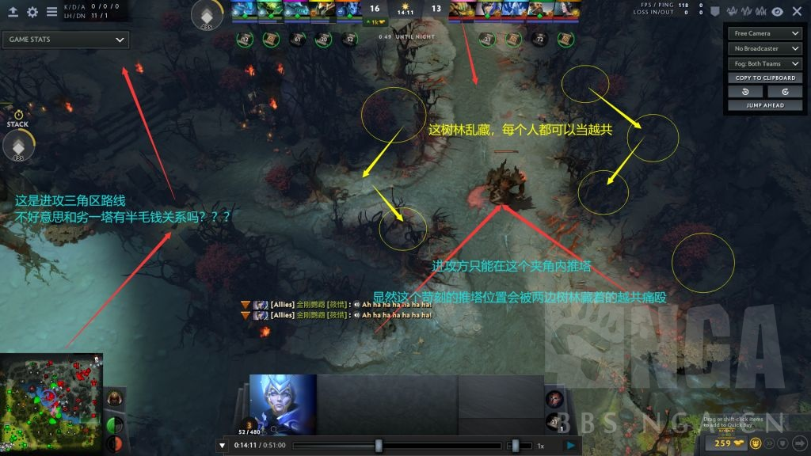

# 手把手教你滚雪球--久远Vortex扫盲式前期基础运营攻略

#### 前排提示

1.本攻略为前期运营攻略，第一篇边路对线教学已经完结。如涉及到我在第一篇中写过的内容，如兵线和野点的概念等，我会默认读者已经掌握。如未掌握，请直接去第一篇攻略中查询相应概念。

2..本攻略为基础运营攻略，只讲6500分及以下路人局的前期常见运营思路和理解。高分首页局的复杂运营变招乃至职业局高端战术一概不讲(太多太复杂不可能讲完或者讲清楚，有的我自己未必都能get到点)。
不过任何高端战术都来源于洞悉最基础的运营思路产生的延伸。如果大家确实掌握了这些基础，那么在之后OB首页局和职业比赛的时候应该也能比之前更为清楚地看懂高端选手的一些行为背后的意义吧。

3.扫盲式教学指的是我直接给出前期运营所接触到的几乎一切概念的定义，并且直接再现由

了解基本定义--思考定义的实质--根据实质做出对应运营举动

的思考过程，帮助大家得出整个运营是怎么来的，而不是强行把如何去做硬塞进脑子。硬塞的遥控教学不知含义，记不到两天必全部忘光，我非常清楚。
所以本攻略的适用时效仍然非常久。尽管可能攻略出了不久后版本即将更新，但是如果掌握了思考的方式，那么无论版本怎么改动，你应该都可以第一时间得出新版本属于自己的运营思路。

4.本攻略受众为想提升运营水平的所有位置选手。只要你可以打字或者有麦，团队不知道的决策你就可以主动接管指挥。一个思路清晰的团队大脑能在配合不那么默契的路人局中起到至关重要的作用。我仍然可以保证如果你将贴内给出的定义全部记住并能贯彻到实战中，那你的前期运营保底6000分水平。
那我们开始吧。

上一篇攻略用了两万多字写了边路对线，写了很多，我知道大家看的也很累。
但是残酷的是，对线毕竟只占前5分钟。

一个打的优秀的对线可以帮你取得先机，但仅靠对线取得胜利无疑为时过早。有的英雄对线强力可以轻易压制对面，但是更多的英雄会在之后的时间里发挥出他的强大作用。只要他们能发挥自己的作用，显然你前期通过对线带来的优势可能会在对面的一波完美团、一波拖节奏、或者一个肉山盾下荡然无存

所以除非对面对线对不到5分钟不想玩了直接敲基地，你仍然得通过后续的一系列运营来为团队创造胜机。

#### 一.前言---运营和节奏

什么是运营？运营就是贯彻你这边5个英雄的特色。

极限发挥英雄优点导致团队在某一时间的强势之处，同时规避英雄短板导致团队在某一时间的弱势之处，就是运营。

所以一个思路清晰的运营自然可以化劣为优，化优为胜

很多人都喜欢说节奏这个词。几乎我认识的所有人都在说节奏。什么带节奏起节奏 有节奏没节奏，打架节奏刷钱节奏，满屏都是节奏。

但是我现在直接了当地问节奏是什么，可能绝大部分人都答不上来。

很多人喜欢说起节奏带节奏对吧。如果你的英雄在最该打钱的时候瞎jb乱跑，折腾两分钟，哪怕杀了两个酱油，结果塔没拔钱没打，对面大哥刷的开心，你这边穷的要死，不好意思你这叫没节奏，叫不带脑子。

如果你的英雄在此刻的最优解是打钱。那么你哪怕这段时间一波团都不去，队友崩的吗都不认识，但是只要你保证最大化获取了经济，那你就是有节奏。队友崩是队友nt运营的问题，只要你思路清晰，你在贯彻自己的思路，你就不必有心理压力。

所以节奏是什么？节奏就是在最合适的时间，干最合适的事。

一个英雄此时该打钱，那么他只要能打钱，就是有节奏。
一个英雄此时该拔塔，那么只要拔掉塔，就是有节奏。
一个英雄此时该带队压图，那么只要你开5逮死对面的核心并占住对面野区，就是有节奏

那我们如何得出什么时候有什么样的节奏，并且如何对此进行运营呢？

这就是我接下来要写的内容。

#### 二.夜晚

路人常抱怨的第一句“地图一片黑”通常出现在第一个夜晚。所有友方单位视野大幅减小，除特定英雄外，大部分英雄的视野由1800码大幅缩短到800码。漆黑的地图带来了更明显的压力和不安全感，使游走更加容易，防守更加困难。

对线随着夜晚的开始而结束。之后是发育、游走、推进的时间。也就是运营的时间。

俗话说天黑好办事。夜晚意味着在这5分钟的时间内利用视野缩减可以干很多事，包括点眼、偷眼(到敌方腹地做眼)、游边、包中、多打少等等等等。

夜晚区分开了对线期和前期。5分钟的那一刻到来，意味着前期运营开始了。

#### 三、二号位运营思路

路人2号位的节奏是游离于整个团队之外的。中路的游走帮忙甚至拔塔实质上是中路个人节奏反哺团队，而并非配合团队的体现。换句话说他选择不动也是正常的，边路该咋打还是咋打。所以我这里一次性把中路讲完，之后再按时间讲边路。

#### 3.1.概括

通常中路的第一个线眼是在开局出兵前就插下。假眼持续6分钟，所以如果没被对面排掉，5分钟入夜几十秒后也会自然消失。
此时的中路危机四伏，此时己方站在中路高坡看不到对面的高坡。这意味着对方辅助甚至不用开5就可以轻易地从中路两边河道动中，而对方中一塔旁的TP也不会被看见(白天需要T塔后树林绕一下防被看到)

而若中单到6拥有强力大招的同时获得了状态符，中单才会选择游走(仅限路人，比赛时中单有时会牺牲个人利益强行游走换取团队利益，但是路人不建议这么做)。此时对面有河道保护眼能看到中单移动，若没有功能符，中单去边路的游走效率就会很低。路人一定要记住有F动的才有效率。

所以这时候的常规中单通常都不会选择继续拼刀而是点眼+推线打野。推塔中单则会配合5分钟刷出的第一辆车尝试磨对面一塔的血量。龙骑骨法或者锤子黑鸟这种英雄都是找机会就磨塔，而DP这种拥有CD极长的推塔技能的英雄则并不会到6直接开大逼中，除非对方中单T了边路短时间内无法回来。
(车子，尤其是边路车子在后面大节说边路时会着重提及)

#### 3.2.中路视野

中路版本改动后并无刁钻眼位，中路5分钟的线眼和开局的并无差异，顶多插的稍微偏一点。
路人一般都是中单自己5分钟看眼快消了趁天黑对面看不到己方河道高坡赶紧补插一个。

请注意，这个补的眼很容易被对面还未消失的眼看到，或者对方通过看到你物品栏中眼消失判断你插眼的位置。

而5分钟不同于开局，酱油已经有充足的资金购买数个真眼。如果酱油铁了心中路两边一边一个真眼，那你补的线眼必被排掉，对面肯定是赚的。

所以如果你想稳定保证中路的视野，那就沟通酱油帮你包后插。

而河道高台的眼其实并不容易被反，因为对方不知道你是插在了中路还是插在了河道高台。被排很有可能是对面蒙到了。插河道高台也可以。

值得一提的是中路的塔后眼一般是酱油摸黑插在塔后方便包中拿塔时使用，之后大节我会配图详细说明。

#### 3.3.发育

一个中单，对线打不过对面，丢人吗？

有人觉得很丢人，有的人看到中路被单杀直接俩信号+个漂亮就发过去了。

打不过分两种，一种是英雄克制，一种是技不如人
单杀分两种，一种是两边激情互拼结果对面以微弱优势取胜。还有也是技不如人被暴打。

当然无论哪种情况己方中单都很亏。队友会嘲讽好像也很有道理，占据了道德制高点。你菜还点什么中是吧。

但是。单杀对面的万古中单，又会被超凡乃至冠绝几千名的中单打爆。几千名的中单排到500名的中单对线会大劣。
那我类推一下，500名的中单排到对面是maybe是不是可以直接拔线下一把了？我是不是也可以说，你菜玩什么中单？

永远有比你厉害得多的中单。

那以后是不是所有人中路打不过就直接下一把了，一把5分钟实锤快餐游戏是吧，这还是dota吗

对线被单杀永远都不可能直接导致输掉比赛。最近奇迹哥招牌卡尔还被topson小松鼠单杀来着，那把好像赢的是nigma吧。

对线技不如人或者英雄克制导致劣势，显得你之后的处理方式更为宝贵。

我最近帮不少人复盘，发现以下这种情况在三四千分段尤为多见。
对面点了个影魔。己方蓝猫三分钟不到就单杀了对面SF。之后己方辅助游死一次SF，蓝猫又单杀了一次。此时蓝猫3-0。 对面SF0-3。讲道理这SF应该是被打爆了。结果我一拉赛后10分钟经济条，10分钟蓝猫3500，SF4600。这里特地说明下蓝猫5分钟前并没有漏很多刀。

结果这个“对线机器”蓝猫被0-3但是10分钟吹风的SF单杀了一次拿了四五百块钱，局势瞬间逆转。蓝猫紫苑遥遥无期，而SF随时可以提款蓝猫。别说即使出了紫苑sf也根本不怕了。很明显，蓝猫前期多次击杀对面的赫赫战功并没有帮助蓝猫拿到更多的好处，反而成为了SF的肥料。

所以到底为什么蓝猫3-0还这么穷？我接着一看。蓝猫到8分钟为止没有碰过一个野点。然后8分钟吃了个隐身符去边路逛了一圈，拿了俩助攻。然后回到中路继续正反补(神TM8分钟正反补)
到了9分钟，终于终于，打了一波小野。

高分点的玩家看到这应该差不多笑出声了。

你觉得是蓝猫会玩还是SF会玩？3-0的蓝猫啊，单杀对面中单2次的蓝猫啊，真的会玩吗？

一个路人中单，最重要的是什么。是保证自己的经济始终处于第一梯队。 而一个能单杀对面多次的强力中单，他的经济10分钟必定是前2前3的。

那比如这个蓝猫拿到的几个人头加几波线(可能你还会乱跑不去吃)能保证蓝猫经济第一梯队吗？

单杀对面这种不稳定因素从来都不是运营的考量，顶多算是意外之喜。高分桌是没那么容易出现中路单杀的，劣可以劣，但是被单杀的机会实在是少。

我相信看贴的中单应该都不能保证对线已经牛逼到通过稳定单杀对面来获取资源了。所以你无论对线再怎么牛逼，到了5分钟都得给我考虑进野。

那如何做到经济保持第一梯队呢？自然得进野。所以5分钟后还搁着中路正反补的赶紧把想法给我改过来。

这里请大家一定要记住
每个英雄，无论他水平有多么高，在不考虑人头等特殊情况下，他在一分钟能获取的经济总量是有上限的。你天梯一万分能让中路一分钟刷3波兵线出来吗？还是能让1分钟一个野点刷两拨野？(屯野是把前几分钟无法利用的野区资源给储存起来，并不是凭空创造资源)

前期相当一部分1号位比如虚空PA小鱼敌法之流并不能有效刷野，所以对野区利用能力最强的是中单。一个路人热门中单，大家可以想一想，热门中单比如SF蓝猫dp女王LINA紫猫TA puck甚至陨星锤黑鸟等等，在到5分钟会后是不是都拥有稳定高效的清线能力。清线能力就决定了你英雄的基础打钱速度。只有迅速清线，你才能迅速去获取其他资源。
所以带AOE的英雄一分钟获取的经济总量上限必然高于不带AOE的英雄。

而个人能力越强的核位英雄，他在单机获取经济时的实际收益就会越接近这个上限。所谓的裤裆掏钱就是他每分钟都比别人刷100多块钱，那10分钟就比对面多1000。

为什么他能比别人多刷100块钱。这就涉及到了打钱路线。

我记得两周前有人分析了AME的luna刷钱为什么这么快。帖子在MAX精品攻略区有大家可以去找一下。

AME的luna几乎每分钟都站在同一个位置，打同一个地方的野，然后按照完全固定的路线走向另一片野，打完再走向下一片野。然后两轮下来回到原处循环。AME的打钱能力毋庸置疑，那他打到的钱就是LUNA这个英雄1分钟能获得的最大经济量。

那相应地，同是核位，一个中单，如果遵循了一个最大化利用经济的打钱路线，那么他打到的钱也差不多是一分钟可获得的最大经济量。

所以解决问题的关键是打钱路线。掌握了固定最大化收益的打钱路线，那你的收益自然就最大化，自然就不可能穷。

我个人是打辅助的，我知道一个核位大概每分钟在哪个区域打钱，但是具体的细节我并没有仔细研究。关于打钱细节我实在没啥发言权，我就不误人子弟了。

那想提升的中单选手怎么学呢？提升方式非常之简单，直接蹲首页局，蹲到前100选手在玩你想练的英雄，直接照抄他1分钟的行动路线。

路人5-10分钟必有中单单机打钱的时间，直接蹲他一分钟开始站在哪，之后打哪个野点，之后什么时候去线上，什么时候线直接放掉给酱油顶。完全照抄即可。这是硬核基础。

放线给酱油顶并不一定亏损了中单的经济，要知道一些清野高效的中单，不吃线反而收益更高。这时候如果中路没人顶线，兵线就会白白浪费。把兵线经济给了酱油 也是反哺了团队。

#### 3.4.如何游走---“带节奏”

对大部分人来说路人中单到边路游走打架就算支援了，杀不杀的掉不管，打架打成什么结果也不管，中单只要去了，就进行了“带节奏”。这个中单就不是喊半天不动的毒瘤中单，是会“带节奏”的团队中单。这样的中单必能在前期就能带领团队走向胜利！

好，这个想法我们先按下不表。我们先来理一理中单去边路游走这个行为在不同情况下能得到的一些结果。

1.中单跑去劣势路配合34杀人拿塔，期间收获人头，1波半兵线和大野点，之后TP回中收线，用时一般1分半左右

2.中单跑去边路配合34或者15杀人，没有人头，塔拿不掉，收了大野点TP回中收线，用时一般1分钟左右

3.中单跑去边路，但是对面信息足够防守到位，中单蹲了一会无功而返，再走回中路收线或者走到野区打野，用时1分钟左右

4.中单跑去劣势路和对面拉锯战，状态打完才换了1个人头甚至人头都没，TP蓝都没了，被迫走回家

5.中单跑去优势路和对面拉锯战，状态打完把对面打退，结果无法TP回中，1号位又不肯去中换线。于是中单要么抢优势路的野点和兵线和1号位发生矛盾，要么走回家T出来，用时2分半乃至3分钟

6.中单跑去边路无脑冲阵，被对面下来支援的中单击杀，复活30秒后T出来收线则用时1分钟左右。若此时中单是TP边路冲阵而死，则会花费两分钟以上。

我列举了中单支援的一些可能情况，当然全部列出肯定不可能。可以看到，中单无论怎么动，都有至少1分钟以上的游走时间，若发生遭遇战或者不幸被击杀可能达到2-3分钟之久。

上一小节我才说过一个中单在5分钟之后可以通过线野双收来达到自己的最大经济获取量。

那么，既然你花费了了本来用于线野双收的1-3分钟的时间，也就是浪费了这段时间你可以获得的经济，那么你的游走一定取得了和线野双收相匹配的辉煌战果吧？

如果是这样，那确实无可指摘。只可惜大家应该清楚自己打的路人局绝大部分都不是这种情况。

在第一例中，一个中单收获了人头，拔掉了优一塔，收到了线，还打了波大野点，最后还能回中继续收线，毋庸置疑收益爆炸。这也是中单游走最想看到的结果。

而在其他例子中，中单的游走收益可并没有梦中那么完美。要么人头被抢，要么状态打完无法进野，要么无功而返，被迫千里回泉，甚至直接去世。

而大家路人排到的中单或者自己玩的中单，游走是第一例结果的局应该比较少吧。

所以我们可以因此得出：在对方边路并非弱到一游就崩的情况下，中单的游走收益是极为不稳定的。

所以中单的游走相当于用自己1-3分钟的高效稳定发育收益换取一个下限低到离谱的不稳定收益，同时为团队打开局面。

而对路人来说，因为路人水平的不稳定带来的各种不稳定现象，所以中单保持稳定的收益作为团队的基本盘比什么都重要。

所以我们可以在此得出结论。除非你判断你的游走可以为团队创造巨大的收益，或者你衡量出你的游走收益必高于于单机打钱收益，不然一个路人中单能不动尽量不动。

创造巨大的收益指：把一条大劣线直接救回正常发育状态、在只靠34拔不掉对面优一塔的情况下稳定拔塔、击杀对方两个及以上核心

更高游走收益指：对面贸然冲塔你TP支援下去就收割两条命、游走目的地有大量野矿供你获取、自身英雄机动高或者有加速符等高机动神符可以杀完人迅速回中继续单机。

如果不能满足创造巨大收益和更高游走收益中的任意一条，那么请记住，哪怕队友鬼哭狼嚎，中单也不会离开中路经济区一步。

你是中单，你是团队的核心和基石。你的经济会高效地转化成很早做出的关键装成为团队最锋利的剑和最坚韧的盾。
你去游走本身就是屈尊放弃稳定收益，如果不能创造相应的战果，即使团队整体上获得了收益，对你个人来说也是血亏。你的个人运营被所谓的“带节奏”毁的一干二净。

单机10分钟5000，比乱跑半天没几个头塔拿不掉10分钟就3000-3500，在路人局中要强不知道多少倍。

一个厉害的中单，能迅速估算出某些情况下的游走收益，判断游走结果对自己的影响，最后作出选择到底动不动。如果大家之前对此一直没有概念，可以尝试着练一练，估一估游走的难度和自己能获得多少经济。估收益的习惯培养起来有助于大家水平层次的提升。

切记，不要被队友嘴里口口声声的“带节奏”迷住双眼。毕竟，你的队友可能根本不知道这三个字到底是什么意思。

#### 四、防御塔

一个推塔的游戏，围绕防御塔的运营肯定是游戏的重要一环。

防御塔到底有什么用？就是兵线上立个塔帮忙砸兵，顺道还是个TP点是吗？哦如果推掉全队能拿点蚊子腿钱。
绝大部分人，对塔的作用也是一无所知。

这也是我平时复盘教学较低水平局时最常看到的崩盘情况：杀人打架勤快干个20分钟，对面一座塔没掉。

那么，很明显我需要单对防御塔进行一个扫盲式定义。写的是前期运营，我就只定义3个一塔了。

#### 4.1.优一塔定义

优一塔是守护优势路主野区，但易攻难守的桥头堡。

当兵线进入优一塔时，优一塔可将兵线弹出至对面劣一塔门口，这个在上篇攻略讲对线的是时候我就说过。
这里既然是5分钟后，优一塔将兵线弹出的意义就是保证对方必须分出人手来处理劣一塔前的兵线以防止浪费大量线上资源。
一旦敌方有核心露头处理兵线，就意味着对方不在视野内的人数减少，也意味着己方在主野区打钱的核心更加安全。

如果己方想去主野区抓敌方正在打钱的1号位，但是并没有拔掉对面的优一塔，那么就会出现这样一种尴尬的情况：
己方抓死对面一号位发现兵线已经到了己方劣一塔前，所以在抓死对面后己方核心被迫T回去收线。而对面核心活了继续拍拍屁股出来打钱，此时明牌无TP的核心直接约等于减员，无法再压制对方主野区。
如此反复，己方在主野区的抓人效率就会低的离谱。

所以如果不拔优一塔，你就无法对主野区造成有效压制。

而优一塔是三个外塔中最好拔的外塔。
塔后空旷的地带极易被做塔后眼，离圣坛和优二塔过远导致若想守塔要么得提前就位罚站，要么得一张一张TP下来葫芦娃救爷爷。t二塔和锅得跑十万八千里。所以优一塔易攻难守。

而在入夜后，3号位到6通常会拥有较强的大招。此时己方刷野效率高的大哥会进野发育，不能刷野的大哥在线上极为危险也会选择换路。所以此时的优一塔必然是减员的。

这就是为什么高分桌两边5分钟一到经常互换优势路一塔的原因：都不想守，但是都想拔掉对面一塔入侵主野区。

那就互换吧。

所以，优一塔的重要性和易攻难守的特点导致前期最迟10分钟出第二辆车时一定要迅速拔掉优一塔。

#### 4.2.中一塔定义

中一塔是最重要的一塔，是守护己方主野区和三角区的扼要关隘。

介于很多人并不理解中一塔的重要性，我直接放图说明中一塔丢失后会造成什么样的后果：

可以看到一旦中一塔丢失，己方的野区防守瞬间千疮百孔。防守方根本不知道敌方会选择哪一条路线进攻，一旦对方大部队不在视野内，野区就会变得非常凶险。大哥不敢打钱，酱油不知道站哪能蹲住。这自然对运营是极大的劣势情形

而相应地，如果我们能很早拔掉对方的中一塔，那么我就可以有很多种选择方式来压制对方的野区。

那中一塔好拔吗？显然不太好拔。离中二塔很近的距离使敌方可以TP2塔支援，中一塔周围的窄地形和大片树林阴影显然看得出易守难攻。酱油蹲在树林里推进方也很难第一时间找出并集火

所以拔中一塔通常得**全队之力强行突破，或者杀死对方关键英雄使对方无力守塔：可以是核心，也可以是守塔过于恶心的辅助如光法/剧毒

这就是首页局乃至职业比赛有时候10分钟出头甚至10分钟不到5个人全部集中到中路强拔对面中一塔的目的：
拔掉，野区就好进了。拔掉，压制就好打了

路人中一塔拔的早不早和你的压制运营直接相关且极为重要。拔中塔运营我会在之后进行说明。

#### 4.3.劣一塔定义

劣一塔是最没有战略意义的一塔，同时极为易守难攻

劣一塔不能保护野区，地理位置偏僻离野区远。你动员大部队奔袭劣一塔并不能带来相应的收益。

同时劣一塔地形还过于阴间：大片联通的树林可以直通劣二塔，大量树林位置可以藏身，防守方支援也可以直接t劣二塔走两步路就就位。

路人局多少运营崩盘都是优势方莫名其妙不带脑子强拔劣一塔被打了团灭一波翻直接不会玩了

拔掉劣一塔通常只有唯一的一个意义：可以让兵线推至对面劣势路二塔处逼对面回防收线。

所以很多情况下优二塔甚至中二塔都拔了，劣一塔还好好的在那。

劣一塔通常不做任何运营，除非对方3号位崩的妈都不认识直接放线跑路，一号位一个人配个5对线期一过随随便便就把劣一塔A掉了

所以拔劣一塔只有4种主要情况:
1.推塔中单如dp骨法去优势路帮忙杀了所有在线上的人，在对面读秒的时候把劣一塔拿了。

2.对面34弱到站不住线，放了劣势路不站人，己方1号位刷着刷着顺道把劣一塔推了

3.己方强无敌，拔完劣一塔打算直指劣二塔逼团，这时候是全队拔劣一塔

4.上路近卫一塔比起天灾下路一塔有一个特殊的作用就是肉山团tp点，所以如果天灾方想控盾，得拔这个上路一塔

其他的绝大部分情况都不应该集中3人及以上去拔劣一塔，如果经常做出带全队拔劣一塔的运营，说明你的思路有较大问题，建议多去思考此时干什么事会更优

#### 五、1号位运营思路

既然说完了防御塔 尤其是优势路1塔的定义，那么就可以解锁1号位的运营思路了

首先我们来看1号位入夜后待在优势路可能获得的资源有什么：
一分钟的2波线(还可能会被对方拉大野或者反补消兵消掉经济)，一波小野，一波大野(可能会被对面打掉，也有可能抢不过对面)

还有哪里有资源呢？

没有了。没错就是没有了，你还能从哪打到钱？

所以如果一个1号位，待在优势路可以获得的经济量并不高。

所以我们要明确一点：
强1长时间站优势路线不进野并不是为了保证自己高效获得经济，而是为了压制对面的弱3不给他获取经济。如果纯为了刷，优势路线收益并不高。
(当然还有种可能是这个1根本打不了野，打野收益还不如上线补那两波兵。关于这个下面还会说到)

如果是强1还好，起码能稳定收获塔旁边小野和大野的经济同时能压制对面3发育。如果你是弱1，那野点完全被对面控制在手里，那你只能吃对面剩下的残羹冷炙---仅仅1分钟的那两拨兵可能还不满的线

而我上一大节才说过，优一塔易攻难守，是前期最好动手的地方。5分钟一过，优一塔直接变成高危区域。你不知道中单没露是去打野了还是来提你了。你不知道对面45消失是去插眼屯野了还是来包你后面了。3号位捏个大招遁入阴影随时取你狗命。

那这优势路，不待也罢。

#### 5.1.进野

所以入夜后的1号位，只要你打野效率比较高，必须，马上，立刻，给我进野！
代表英雄TB SV 骷髅王小娜迦美杜莎等刷野英雄。我最近帮人复盘的时候经常看到这类英雄5分钟以后还傻愣着站线上待到10分钟，然后纳闷为啥咋这么穷打不到钱。
不管你线优不优，请把这坏毛病改了直接给我进野。

如果你的英雄可以打远古，那必打远古！
正常的资源量是远古>线上>大野>中小野。而通过组合，你可以通过规划打钱路线，刷远古区-去线上把进塔线顶出去,或者远古区-主野区，保证自己每分钟打到最多的钱。
所以请直接从优势路一路刷到三角区开始利用远古的资源。一个1号位能否利用远古经济，直接导致他打钱是否高效。

至于进野怎么刷效率最快，和我楼上说的抄中单打钱路线一样，直接去首页局抄职业1打钱路线。别人一分钟从哪开始打哪波野刷到哪，一帧一帧抄下来。然后自己开单机熟练，保证把打钱路线变成自己的东西。某些选手玩个C不会打钱，自己无干扰打钱慢的离谱还要把锅甩来甩去，那你真是弟中之弟。

进野后那线咋办呢？放酱油顶。

这就是高分常说的放酱油顶线。一是护着塔，防止线上没人对面无干扰安逸推掉一塔，二是获取团队弃置资源。

这是站在中单和1号位的角度考虑的东西：着重于最高效率地获取资源，食之无味弃之可惜的资源让酱油去获取。

酱油获取的经济也是你的团队总收益。线被小兵a掉被塔砸掉，那经验和经济就真的是被浪费掉了。

#### 5.2.换线

一旦1号位判断出这把5分钟后待在优势路=坐牢，那肯定是不能继续待在优势路了。
那如果1号位并不能高效打野呢？一刀刀扣野怪也太慢了，那打钱路线肯定是要包含兵线而非远古的。

显然最直观有效的方式就是换条线打钱。

同时，你优势路坐牢，难道对面优势路就不坐牢了吗？

这时候高分1号位，尤其是有能参团大招的1号位比如虚空，会主动tp劣势路找3号位打一波力求拔对面优一塔。

这样又压制了对面，又解锁了新的地图：对方主野区。

既然我方主野区和优势路线不好站，那我们去对方主野区和优势路线刷不就好了吗？

推掉优一塔，不容易死的3号位看情况包中或者去优势路吃资源，1号位就获取了一大片资源区：三角区--劣势路线--对方优一塔旁野区。如果你觉得安全，比如对面主野区点了视野，你甚至可以刷到对面主野区。

这样你是不是比拴在优势路担惊受怕舒服得多了？

这就是高分局出现率极高的基础运营：互换优一塔--互换主野区。
两边都不想守，两边都想攻。那就互相换掉就好。

当然如果你推不掉塔，你就待在劣势路刷钱，也是很安全的。之前我说过。劣一塔易守难攻。撤入劣一塔就非常安全。3号位和1号位换位去上，资源也不会浪费。

换塔换野区是区别高分和低分前期运营水平的重要分水岭。掌握换塔，结合上面的打钱路线，1号位无论如何都不会穷。所以请不要一穷就怪队友，低分局的低压环境1号位无论怎么刷都不可能穷的。多去找找自己的问题，比把怒火倾泻在你这辈子可能都排不到第二次的队友上，要好很多了。

#### 六、5分钟开始的辅助位及3号位运营

之前我们已经写了1号位和2号位前期运营思路。
可以看出，1号位前期运营最重要的就是打钱，一切举动不离高效打钱。
2号位前期运营同1号位一样打钱为主，辅以支援游走反哺团队的同时也不落下自己的经济。
路人1号位大部分情况下5分钟之后打架来都不来，2号位看情况来，但是不来也是常态。

那么实际上路人盘活全局的运营方向并不以12号位，而是以345为主。

既然一个英雄点出来打3号位，那么这个英雄在前期吃了一定资源，比如到6并有了些基础装备之后，可以成为团队的重要支点：强力的技能、难缠的特点、够硬的身板、快速拔塔等。

那团队的运营肯定是往支点3号位上靠。通常在3号位需要单人补线并没有安全威胁的时候，运营才会往中路2号位上靠。

45号位过了对线期结束了保线后，则会成为团队重要的润滑部分和运营发起者：
他们可以让一条线增加压制的筹码、可以储存团队的经济(屯野)、可以顶住大哥不要的线避免己方资源浪费和塔的血量无意义地被消耗、可以保证团队的安全视野、可以出奇招击杀敌方核心或者点亮敌方核心所在位置方便之后处理等等。

那么接下来我们就开始前期运营中最为重要的部分了。掌握这个部分，345才能把局势牢牢地把握在手里，而非梦游挂机不干人事。

#### 6.1.五分钟最重要的东西--投石车

投石车每5分钟刷出一辆，第一辆投石车5分钟整刷新。
我可以说，6000分以下的几乎所有选手，都对这个投石车没有任何想法。

车子是干嘛用的？钱多一点？很肉打不死？

5分钟的投石车935血，魔抗80。车非常肉可以顶一波兵很久，英雄若无特殊技能如POM箭秒车，得A很久很久。
这意味着车子可以稳定地存活很久。
但是车子被防御塔攻击4次就直接爆炸。所以车子进塔如果没小兵抗住，直接就光速去世。

既然是投石车，那么肯定推塔很有用。
直接上定义：车子A兵基本不掉血，但是A一下塔能掉60血，3秒钟A一次。车子攻击范围内有防御塔则不会被勾兵吸引仇恨，只会对塔进行攻击。

这意味着什么？一塔1800血，只需要半分钟也就是一波兵的时间，车子就可以输出掉塔3分之一的血。如果你能保证线在对面塔里两拨兵的时间车子一直在输出，哪怕你没有任何推塔技能，光车子就能拆1200血，再配合英雄和小兵平A，这个塔基本上没爆炸也基本只剩个血皮了。如果你能给车子加攻速或者自带推塔技能，那么一波兵多，对面一塔基本就没了

所以发现了什么？

并不是一定需要推塔技能。只要保住车子持续输出一分钟以上不被对面塔A掉，就能推掉一塔。

所以是不是很多人的理解被刷新了？

接下来的5分钟第一波最主要运营方向就是以这辆刷出的车子为主。

#### 6.2.五号位优一塔顶线思路解析

结合上面优一塔的定义，5分钟后优一塔区域会变为易攻难守之地。

如果客观因素对面线上较强，即使你保线水平足够，大哥线上不舒服，这条线在5分钟后就会变成一条烂线：极为危险、收益低下
而此时如果你动，大哥单人混线必坐牢。如果大哥进野你也动，那这条线没人顶，一塔随便就被推掉，同时线上资源会被塔砸掉造成浪费。

这个时候。一个聪明的5号位要做的事只有一件：精神控制1号位打野或者tp劣势路去，自己顶优势路的烂线。

线被5号位放技能配合塔迅速消耗对方兵线，这样可以使对面的车子暴露在塔的面前。一旦车子被毁，单靠对方无推进能力的3号位，拔优一塔就需要拖好几分钟甚至拖到10分钟的第二辆车了。

如果劣势路或者中路开战了，5号位t劣势路也能迅速支援。

如果自家劣一塔推进效果不好3号位过来优一塔了，你就可以动了。

如果发现对面聚集起来准备推你家优一塔了，看情况不对可以直接撤离。当然一个好的藏树林位甚至可以在对面推完塔都不知道你的存在，如果你觉得优一塔可以守赢一波团，你事先藏好也会对这次团战取得至关重要的作用。树林位楼下我会放图。

如何发现对面聚集？那自然优势路有那么一个保护眼。所以楼下也会有眼位图。

点眼的最核心定义：什么地方需要视野就在什么地方点眼。
(在之后的内容我随时会反复插这句话精神污染你们)

结果上，大哥成功避免坐牢，你成功获取了团队弃置资源，同时又保证了你作为一个5号位随时可以支援其他路，最后还能作为可能产生的守塔团的一个重要筹码。

这个5号位，是不是就非常有作用了？又拿了钱又办了人事，是不是就比到处乱跑高端到不知道哪去了？

至于如何精神控制一号位，考验的是你的话术和沟通能力

兄弟这线实在不好打，你看着能不能跟3号位换个线吧/你看着能不能进野吧会舒服一点，这烂线我来顶

要你家1号位游戏理解实在低下，硬要顶这个烂线坐牢不肯动，5号位请毫无心理压力地放弃这个nt准备开始动。你已经给他提过建议了，你已经仁至义尽了，逮捕他的不是对面，是他自己。

两方优一塔的保护眼位和藏树林位如下图
优一塔眼位  

− 6.3.拔敌方优一塔运营--三四五联动 ...

#### 6.3.拔敌方优一塔运营--三四五联动

#### 6.3.1.三号位视角

玩三号位的人，入夜的一瞬间，就该有一个短时间判断：
我这时候算肥还是算穷？
我这时候战斗力是否已经足够强到45随便来人就能乱杀对面？
能否靠5分钟刷出的车稳定打击甚至拔掉对方优一塔？

如果你偏穷，你想补。那就继续占着线补，或者和我楼上说的那样跟1号位换线去优势路补。一般3号位都够肉，顶着优一塔对面也不好推。
这样45解放可以去中路找2打，或者去屯野顶线保证资源不被浪费

如果你偏肥或者强力，你就直接把45拉过来和自己一起捅对面杀人拿塔即可。

如果你偏肥但是5分钟还是想补一会咋办？教一招，看了就会。
5分18秒自己拉大野，或者让4拉大野，让这波带车的线全部跑到大野点处。
你会发现大野点迅速消掉了兵线，但是却打不动车子
而你家的车子因为被拉到了仇恨，会一直去和大野battle。

对面的车子因为没有对应兵线，直接推到了你家劣一塔里。

迅速清掉这波兵，塔a4下处理掉车子。

这说明了什么？这意味着5分钟的车子并不会在30秒之后直接进对面一塔，而对面可以抗兵线的车子被你处理掉了。而只要你将大野打完，车子自然就会回到线上继续推进。

这意味着什么？意味着，你存住了5分钟的车子。如果你想让车子上线，那就把大野清掉即可。

这说明了你可以自由操控这辆车子上线的时机。比如到了6分钟，车子还在那A野。
6分钟你想推了，大野一清，喊人。

到6拔优一塔是3号位的本职工作之一，具体操作很简单，杀人逼塔，兵线被塔A完了肉身抗几下等到下拨线进塔，车子输出两拨线配合你平A，一塔炸了。

3号位拔这个塔还需要注意什么呢？注意下对面支援。没了。

#### 6.3.2.五号位视角

上一小节我们说的是优势路坐牢五号位顶线的情况。那必然有优势路顺的情况。
1号位站线站的很稳，压住了对面3，对面3迟迟不能到6。
这时候5即使在线上也帮不了1号位太多：多a对面几下？还搁着拉野控线？
(当然此时可以拉野，主要目的不再是控线而是消兵恶心对面3，但是野点通常容易被大哥打掉，那你拉啥，拉空气吗)

而自家大哥可能刷着刷着看情况就会渐渐刷到野区去。

如果暂时不需要5去顶优势路线，那5自然就可以动了。可以是帮中灌瓶，可以是做眼，可以是去劣势路合体。

帮中运营我们之后说，先说去劣势路。

既然劣一塔狗都不碰，中一塔易守难攻，如果你不想动中路的手或者不好动，那5分钟开始最需要进攻的地方显然就是对方优一塔。

己方3号位要是个夜魔军团马尔斯什么的强3还好，34两个人就足够强力了。你过去捧个人场随便乱宰。

如果是个龙骑呢？也不是特别强是吧。龙骑是个伤害有控也有，但是都差点意思。即使龙骑到6有龙，好像也没办法仅靠自己对对方造成多大威胁。

如果是个大屁股呢？大屁股火雨总伤很高，但是留不住人就是白搭。而大屁股前期只有1级圈或者甚至不点圈，控制能力捉急。

如果是个人马呢？人马输出爆炸控制足够，但是要想让人马走到对面脸上踩到人好像不是一件容易事。

这时候，45的联动就很有意义。帮助这些各方面差点意思的3打出自己的最理想作用。

45配合开5从三角区直接包优势路找3联动准备叫杀。两个辅助的技能给上，这些比较残念的3号位就能发挥作用了。
为什么开5？楼上才放的防守眼位图忘了吗？俩傻子屁颠屁颠眼下跑过去是个人都知道你俩来了

杀人，拿塔。

说是四五号位视角，其实主要还是五号位视角。4号位要么一直在线上，要么在中顶线。叫了只要能过去就行了，主体拔塔运营发起者应该是三五。中单通常是看着呼叫当空投支援用，能来肯定容易打，不能来也不是不能打。

如果做不到杀人拿塔，那就继续补吧，45去找中路打。3要是不肯打2也不肯打，那三路都在刷可太蠢了，老老实实多点保护眼挂机吃点零头线钱或者蹲大哥吧。三个人都在刷想必之后一定很肥吧，等关键装再打

#### 6.4.破优一塔后运营--包中

上面我说了大概破塔的思路，具体怎么去打还得去看具体情况来。
但是最起码的一点就是，无论你怎么运营，最迟都得在10分钟配合第二辆车子把对面的优一塔拔掉。绝大部分路人局最迟拖到第二辆车时一塔是必拔的，拔不掉说明你运营出了大问题，或者你家阵容出了大问题。

因为再往后，你要么得拖到15分钟等第三辆车，要么得在10分钟之后再组织大部队去拔优一塔。

一个本来早就该被推掉的一塔，存活了那么久，那这个一塔的作用就已经远超期望了：
顶了无数波线，稳定给我方的兵线造成压力，同时使我方入侵野区的效率大大降低。

节奏就是在最合适的时间干最合适的事，所以任何的运营都要加以时间限制。
你在5-10分钟就该干完的事，你拖到10分钟甚至15分钟以后去做，你就是有大问题。
一个敌法12-13分钟狂战大家都会赞扬，但是他20分钟狂战可能会被喷的妈都不认识。
拔塔也是同理，只不过因为大部分人受水平限制不会注意这一点所以苛责较少罢了。
高分局优一塔15分钟不拔这局大概率直接到点，除非你家是超级龟缩防守阵容前期一个能打的都没有，那其实也基本到点了。况且就算阵容大劣，前期开5拔优一塔也不是难事。

那么拔掉优一塔后，会出现什么样的变化呢？

因为拔掉优一塔后核心会去收掉此时过来的下一波兵线，所以兵线会前推到敌方优二塔前，兵线经过一轮反复推拉后则会稳定在对方二塔前面大概小野处左右的位置
(因为兵线并不是同时对位，所以兵线位置会在敌方优势路线上来回移动。)

同时由于优一塔的丢失，对方丧失了一大部分对主野区的控制能力。大哥不敢收优势路的线，而若其选择打主野区的野，己方从优一塔旁野区进攻主野区，敌方若无视野保护则主野区大哥必**。

所以主野区在优一塔被拔掉后是危险的。

那么相应地，为了在破优一塔后控制敌方野区，己方的辅助在破塔前通常会在敌方主野区点眼。而若破塔后点眼一般配合开5插到深处，因为破塔后直接进野区点容易被敌方的防守眼看到。

这里在对方主野区的眼位我就顺道并到接下来的路线图里了，不会点的非常详细，只要能看到较多信息就是不错的眼位。

点眼的最核心定义：什么地方需要视野就在什么地方点眼。

这里拔完优一塔后如果选择对刷等自家3关键装比如跳刀，或者占住敌方主野区把对面压在三角区的这种小学生都会的操作我就不谈了。

这里着重说一个点就是包中。

经常看主播打首页局的观众可能会听到一个比较常见的词就是包中。

既然是包中不是推中，那肯定就不是走中路兵线正面刚对面中一塔，而是字面意思上“包过去”

中一塔既然易守难攻，那正面对垒显然守方占优势。

那只要包到对面后方突袭中路使敌方关键守塔英雄丧失战斗力，显然进攻方就会占先机。

通常优一塔拔掉后己方3若有战斗力并不需要刷到关键装才能打，己方会选择在优一塔旁位置开5直接走主野区直插中一塔斜后方。

若路径上有敌方一号位那直接宰掉，若一路无事则会准备突袭中一塔开团杀人拿塔。

下面放出双方包中图解

包中的优点不用我提一看就懂，下面说下注意事项：
1.通常3号位得打架强力。比如你带马尔斯包中必见血，但是如果带个刚背包中可能没有任何效果。

2.己方3号位急需跳刀，或者己方3号位此时战斗力并不足以支撑中路开团时不包，等3号位打钱。大鱼差500跳你不等大鱼把跳打出来无脑带着大鱼包中，然后大鱼死一波心态直接爆炸。

3.要保证345破5必秒一个，如果345加起来爆发和控制能力还是捉急，比如你家2345控没一个破5了半天追不上人，或者半天秒不掉人，那属实搞笑了

4.自家3号位想刷不肯陪着你去中，不强求！这就是场外因素了，如果你自己并没有充足的把握，不要强行硬着扭他的想法。一旦你这波没打出作用甚至结果较差比如团没打过，那被你遥控的3可能会非常不满乃至给出大量压力。我自己单排有时候会强行指挥包中，至于看得人需不需要强行指挥，那就取决于看得人的游戏理解了。

5.包中并不是一定要3号位去，45两个人也可以开5去包中，但是同样的前提是这两个辅助能有足够的能力配合中单秒人。

#### 6.5.破优一塔后顶劣势路线

上面我说过，破掉优一塔后兵线在对方优势路线徘徊，此时若兵线在原优一塔位置或者更靠前，那么敌方核心是不敢来收的。

但是如果兵线进了敌方二塔就不一样了。敌方为了避免资源浪费必然会排出一个人TP优二塔赶紧利用这些资源，同时塔前线也比较安全，把线顶出去以后再动。

大家都知道TPCD80秒。

这意味着什么？意味着只要对方tp优二塔收线，那么如果在地图其他任何地方开团，一分半内就等于没他这个人了。同时对方收线时必会暴露位置，你可以很清楚地知道他TP收线了。

这时候如果去找对面开团，是不是必定多打少？对方收线英雄--有时是核心英雄--必不可能出现在这次团战。他被拴在了优二塔旁，比死了还难受。

如果对面宁愿要运营都不肯回防，或者都没TP无法回防，如果自家是个小Y或者LINA，不好意思你家二塔没了。

所以把兵线顶到敌方二塔门口，既可以获得兵线资源，又可以逼对面回防导致战力减员，某些情况下甚至能仅凭一人对敌方二塔造成巨大威胁。

自家大哥一般是要打野的，在地图边缘的线通常是不顶的，并不进打钱路线并且比较危险。

那么顶这个线的任务一般都是交到了4的手里。

你不是想吃资源吗？你不是想打钱吗？好，这么一条肥线，你可以随便收。

很显然通过顶线，4号位在保证自己肥的同时还限制了对面。同时对面是TPcd，4号位作为主动顶线方TP可没有CD，4号位可以直接回去参团。

所以为什么首页局4号位经常站在一条对方没有一塔的线上打钱，我们可以理解了。

这不是毒瘤，相反这反而很团队。毒瘤是从大哥手里抢钱，而这种行为是获取弃置资源的同时牵扯住了敌方战力。

如果你想玩4上分，一定要打肥自己。如何打肥自己？顶线。

当然如果大哥就在这条线上打钱你还当面顶线就是毒瘤了，尽量避开核心刷钱区域，去鸟不拉屎的地方顶。

我这里写的是顶劣势路线。顶优势路线也有同样的牵制效果，但是对方劣一塔通常狗都不碰，所以劣一塔会成为砥柱阻挡住兵线前推。如果敌方劣一塔已掉，那么顶己方优势路线到对方劣二塔前也是可行的。

#### 6.6.五分钟后的辅助游中

让我们把时间倒回到5分钟入夜时。

如果边路机会不多，辅助待在边路也不能帮上太多忙，而此时中路自家中单击杀能力强力，或者敌方中单抗游走能力较差，或者两者皆有，那么动中就是一个可考虑的选项了。

游走这个东西没有一个稳定公式化的模板，因为游走本身就有强随机性。可能你们收获颇丰，可能你连着你家中单一起去世。有些东西不是我用文字就能概括表达的，要结合具体阵容，具体局势发展方向，眼位，中单水平，英雄特质，是否叫的动人等等不确定因素。

所以我这里只会写出一些大概游中路线。具体如何根据当前对局去做，这才是水平的体现。

图中的路线能明显地看出是4号位还是5号位的路线。当然45一起动效率更高，但是会放两条路单，建议结合具体情况取舍。

注意事项只有一个：
跟自家中单统一意见。自家中单不想杀对面想打野，你蹲中路蹲半天发现中单进野了，那你也有点搞笑。

中单叫人了，或者你判断可以动了，就可以按图里路线去游走了。

还有一种情况是中单是个dp龙骑到6想强逼对面中一塔，这样请辅助直接tp中路站中单旁边捧人场护着中单推塔即可。

#### 七、屯矿和矿团

屯矿我这里大概提下。普通野点一般遵循路过到时间就屯的原则就行。或者自家大哥是TA飞机SV这种屯矿收益极高的英雄，你可以专程去屯。对面有类似英雄，就按我上一节的路线在5分钟后去封远古。一般不用急着5分钟前封，白天容易被看到，并且前5分钟都在线上也没人去屯远古。

拉野时间我就不放了。说实话自己单机去试两遍怎么拉野，比我在这里长篇大论再贴一大堆拉野教程要好得多。自己亲手去做成了，记忆一定是最为深刻的。

接下来就是想办法发现对方是否屯矿，然后双方围绕矿点进行野团。

前期阵容战斗力不行,屯矿不要屯太多。抢矿的本质是逼团，你不来就抢你矿，你来护就打。如果团接不过，你就会给对方创造大笔收入。

打矿团的时候记得就地点高台假眼创造视野优势。

#### 八、其他

蹲人我就不写了，有手就行。论挂机技术相信在座各位水平完爆我(笑)

如果三路都确实要刷，那就老老实实点防守眼屯矿蹲人打钱破5。一般这种局酱油是很无聊的。

这时候如果不知对面位置，酱油可以在某些危险位置乱跳勾引对面去动你手为大哥创造打钱空间。

前期运营基本上到这就差不多了。控盾一般属于中期运营，10分钟能控盾的阵容本身就很不常规了。

#### 九、结语

帖子开头我预计得两周才能写差不多，结果还是爆肝一周内写完了
截至此处共16650字。
未看第一篇的的记得去看。

因为是运营，远比对线难写，如何分小节属实令人折磨。所以花了不少精力。
虽然很累，但是写的时候还是挺惬意的。

整篇看完的观众可能会注意到，我一直在写几号位该怎么做，而非具体到特定英雄。

说到底，运营就是由大方向到具体行为的思路。

根据己方阵容的大致特点给出一个大概的运营框架，然后再细化到每个英雄的独特之处。

阵容推塔点可能是龙骑，可能是TA，可能是骨法。
核心可能是打架核比如30拍拍，可能是刷核比如SV。
可能偏小规模作战，可能偏抱团多人压制。
等等。

大致清楚了运营方向，再把英雄特点往里面填。

我不会和其他搞教学的一样去遥控大家：这把你玩这个英雄这里该干嘛，那里该干嘛。

大家的分段不同，层次不同，阵容不同，具体局势发展方向不同。仅仅给出一个限死的框架照着抄，可能下一把就是截然不同的情况。

你不是我，你不知道怎么处理这一把之外的情况。

你只能两眼一抹黑。

我想写的是一个整体的运营思路过程，然后大家根据结合这个思考模式，结合具体玩的英雄，队友的英雄，再分类细化。

最后得出属于自己的运营方式。

很多人觉得，我不厉害是因为我的操作不如别人，他们操作好多细节，好硬核好nb，我做不到。

DOTA真的是一个吃操作的游戏吗？玩个蓝胖骷髅王就两个技能，点到人就能放到，真的吃操作吗？那为什么高分和低分的这些英雄水平差距还是大到离谱？

哪怕是所谓的复杂操作英雄，斧王岛练一个月保你熟的不能再熟。

差距最终还是体现在理解层次上。

所以这也是为什么我写这两个加起来五万字的教学的原因。

放眼全网，真正去教你运营理解的帖子几乎不存在。大部分攻略仍然拘泥于技术层面：这英雄该怎么玩，怎么出装怎么加点。

然后你学会的只有这一个英雄的死套路打法。

你会玩蓝猫，你就不会玩火猫了吗？你会玩人马，你就不会玩大鱼了吗？

找出英雄的共性，通过结合自己共性的运营理解，再得出特定英雄的思路。

举一反三，这才是最有成效的提升方向。

最后，这只是前期基础运营扫盲。复杂的我一概没写，也写不了。

局势错综复杂，水平层次不齐。说到最后确实只能用3个字概括：看着打。

如何应对复杂局面去“看着打”，才是选手真正水平的体现。

我希望看贴的选手不是无脑抄，而是真正意义上把我写的东西去思考去实践，结合成属于自己的运营思路。

授人以鱼不如授人以渔。

说实话运营这东西我也是第一次写，可能排版或者遣词润色各方面都有不少问题，请大家包涵一下。

看完贴如有疑问可以直接回帖大胆问出来，问题藏着永远都不会解决，问出来才能解决。我会一直在贴里回答大家的疑问。

如果想进一步提问或者想找我一对一复盘的可以加我QQ群255742091找我私聊。

那么就写到这里吧，能耐住性子看到这的人我敢保证你的水平肯定提升了不少。

我已经尽力去写了，接下来的提升靠你们自己了。

完结。

